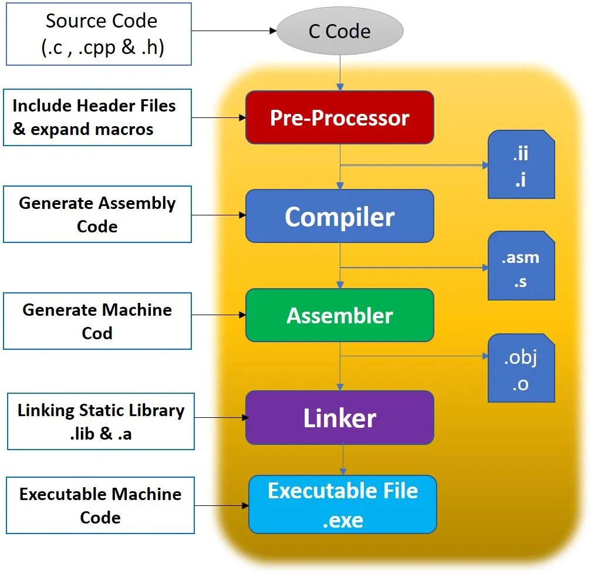
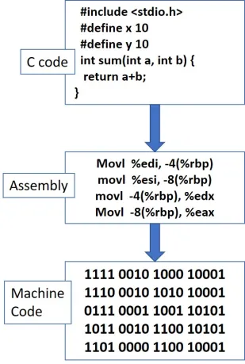
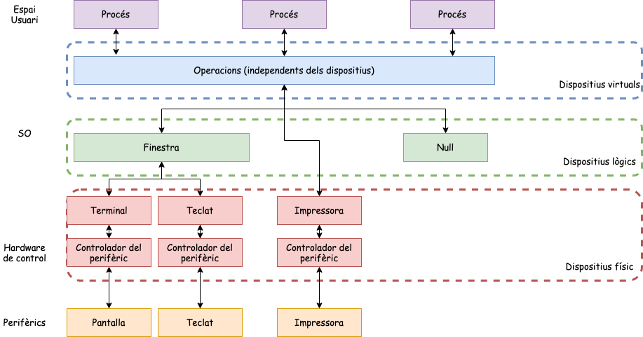
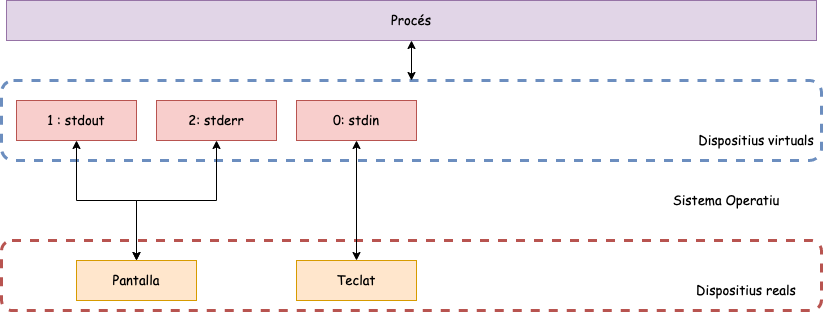
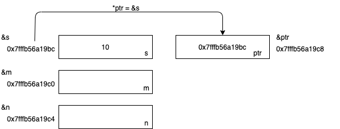
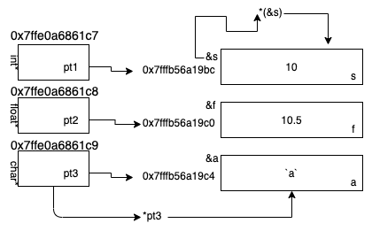

# Introducció

## Desenvolupament en sistemes Linux/UNIX

El desenvolupament de programari de sistema el realitzarem amb els llenguatge **C** i basa en els compiladors **GNU gcc**.

```sh
#!/bin/sh
# ./check.sh
gcc -v
if [ $? != 0 ]; then
       echo "GCC is not installed!"
fi
ld -v
if [ $? != 0 ]; then
        echo "Please install binutils!"
fi
```

[Fitxer: [scripts/check.sh](https://github.com/OS-GEI-IGUALADA-2425/intro_prog_sistema_1_c/blob/main/scripts/check.sh)]{.bsp}

::: notes

Per poder desenvolupar en C en un sistema Linux/UNIX necessitem tenir instal·lat el compilador **GCC** i les eines de **binutils**. Aquestes eines són necessàries per a la compilació i enllaçat dels programes. Per comprovar si tenim instal·lat aquestes eines podem executar el script anterior. Si no tenim instal·lat aquestes eines, podem instal·lar-les amb la comanda ```sudo apt-get install build-essential``` en sistemes basats en Debian o ```sudo dnf groupinstall "Development Tools"``` en sistemes basats en RedHat.

:::

## Navegant a les entranyes del compilador GCC

::: columns
::: {.column width="60%"}

{width="80%"}

:::
::: {.column width="30%"}

{width="90%"}

:::
:::

::: notes

Els llenguatges de programació compilats són aquells que es tradueixen a codi màquina abans de l'execució. Aquest procés de traducció es realitza per un programa anomenat compilador. El compilador és un programa que tradueix el codi font d'un programa escrit en un llenguatge de programació de nivell alt a codi màquina. En el cas de C, hi ha diferents etapes codi, ensamblador i enllaçador. El compilador GCC és un compilador de codi obert que es pot utilitzar per a la compilació de programes en C, C++, Fortran, Ada, etc. Aquest compilador és molt potent i permet la compilació de programes en diferents plataformes. A més, el compilador GCC és molt flexible i permet la configuració de diferents opcions de compilació.
:::

## Etapes de la compilació i l'enllaç (I)

### Preprocessador

> * El preprocessador processa el codi font, buscant instruccions que comencen amb un hash (#), com **#include, #define, i #ifdef**.
> * Inclou fitxers d'encapçalament (**headers**) i substitueix *macros i definicions*. [També elimina els comentaris]{.alert}.
> * Genera un fitxer de codi font amb les instruccions del preprocessador processades, preparat per a la compilació.

### Compilador

> * Traduïx el codi font preprocessat al llenguatge assemblador equivalent. En alguns compiladors, el codi es pot convertir directament en codi màquina en aquesta etapa.
> * Traduir el codi de nivell alt al codi de nivell baix i optimitzar-lo per al maquinari subjacent.
> * Genera un fitxer de codi assemblador amb l'extensió **.s**. Per exemple, si el fitxer de codi font és *hola.c*, el fitxer generat seria *hola.s*.

## Etapes de la compilació i l'enllaç (II)

### Assemblador

> * Converteix el codi assemblador en **codi objecte** o codi de màquina.
> * Produir codi binari que pugui ser entès per la CPU.
> * Genera un fitxer de codi objecte amb l'extensió **.o**. Per exemple, el fitxer resultant seria `hola.o`.

### Enllaçador (Linker)

> * Enllaça el codi **objecte** amb les **biblioteques** necessàries per crear l'executable final.
> * Organitzar i combinar el codi objecte i les biblioteques, *resolent les referències externes*.
> * Genera l'executable final, que és el fitxer que podeu executar. Per exemple, **hola**.

## Exemples de les sortides de les diferents etapes

::: columns
::: {.column width="50%"}

### Codi font

```c
#include <stdio.h>

#define x 10
#define y 5

int 
main(){
  printf("El resultat de l'opearció: 
      %d + %d = %d\n", x,y,x+y);
    return 0;
}
```

[Fitxer: [sources/ex1.c](https://github.com/OS-GEI-IGUALADA-2425/intro_prog_sistema_1_c/blob/main/sources/ex1.c)]{.bsp}

:::
::: {.column width="50%"}

### Instruccions per generar els fitxers

> * **Executable**: ```gcc -o ex1 ex1.c```
> * **Assemblador**: ```gcc -S -o ex1.s ex1.c```
> * **Codi objecte**: ```gcc -c -o ex1.o ex1.c```
> * **Preprocessador**: ```gcc -E -o ex1.i ex1.c```
> * **Desensamblador**: ```objdump -d ex1.o``` o ```objdump -d -M intel ex1```

\onslide<6->

### Nota

> * `-M intel` indica l'ús de la sintaxi Intel per a una millor llegibilitat.
> * Tots aquests fitxers generats els posarem al .gitignore.
:::
:::

## Com funciona el compilador GCC?

::: center

```bash

gcc <codi> -g -c <codi> -o <executable> -I <dirIncludes> -L <dirLibs>

```

:::

> * **-g**: Genera informació de depuració.
> * **-c**: Enllaça només el fitxer especificat.
> * **-o**: Fitxer executable de sortida (per defecte a a.out).
> * **-I**: Directoris on es cercaran els fitxers **.h**.
> * **-L**: Directoris on es cercaran les biblioteques.
> * **-l**: Biblioteques a enllaçar.
> * **-Wall**: Mostra tots els missatges d'advertència.
> * **-Werror**: Converteix els missatges d'advertència en errors.
> * **-Wextra**: Mostra missatges d'advertència addicionals.
> * **...**: Altres opcions.

## El nostre primer programa: Hola món

::: columns
::: {.column width="50%"}

### Pas a pas

> 1. **Preprocessador**: El fitxer *stdio* proporciona la definició de la funció **printf**.
> 2. **main()**: Funció principal i obligatòria. Aquesta no rep cap argument i retorna un enter.
> 3. La funció **printf** rep un argument del tipus ```char *```.
> 4. **return 0**: Indica que tot ha anat bé i acaba la funció *main()*.

:::
::: {.column width="50%"}

```c
#include <stdio.h>
/* This is a comment */
int main()
{
    printf("Hola món!\n");
    return 0;
}
```

```sh
# Compilem hola.c
gcc -o hola hola.c 
# Executem hola
./hola 
```

:::
:::

::: notes

La funció **printf** es troba a la biblioteca estàndard de C, podem consultar `man s3 printf` per obtenir més informació. Aquesta funció permet mostrar text per pantalla. Els arguments que rep són una cadena de caràcters i els valors que volem mostrar. Els valors es substitueixen a la cadena de caràcters mitjançant el format `%d` per a enters, `%f` per a nombres en punt flotant, `%c` per a caràcters i `%s` per a cadenes de caràcters. Els caràcters `\n` indiquen un salt de línia.

:::

## El nostre primer programa amb llibreries externes

\onslide<1->

```c
#include <math.h>
#include <stdio.h>
int main (void)
{
  double x = 2.0;
  double y = sqrt (x);
  printf ("La rai­z cuadrada de %f es %f\n", x, y);
  return 0;
}
```

[Fitxer: [sources/arrel.c](https://github.com/OS-GEI-IGUALADA-2425/intro_prog_sistema_1_c/blob/main/sources/arrel.c)]{.bsp}

\onslide<2->

```bash
// Complilació amb ruta global a la llibreria
gcc -Wall SO_usingLibraries.c /usr/lib/x86_64-linux-gnu/libm.a -o calc
// Compilació utilitzant la forma abreujada
gcc -Wall SO_usingLibraries.c -lm -o calc
```

::: notes

Per obtenir informació sobre la funció **sqrt** podeu consultar la pàgina de manual amb la comanda ```man -s3 sqrt```. Aquesta funció es troba a la biblioteca matemàtica, per això cal enllaçar-la amb el programa. Per això s'utilitza l'opció **-lm**. Quan compilem un programa en C, el compilador pot incorporar certes funcions de la biblioteca estàndard de forma automàtica perquè són part de les especificacions del llenguatge (com printf, scanf, etc.). No obstant això, altres funcions, com les de la biblioteca matemàtica, no es troben dins d'aquest conjunt i, per tant, cal especificar manualment que volem enllaçar-les amb el programa.

:::

## Activitat: Calculadora (I)

::: columns
::: {.column width="33%"}

```c
// calc.h
#ifndef CALC_H
#define CALC_H

double suma(
  double a, 
  double b);

#ifndef CALC_H
```

:::
::: {.column width="33%"}

```c
// calc.c
#include "calc.h"

double suma(
  double a, 
  double b) 
  {
    return a + b;
  }
```

:::
::: {.column width="33%"}

```c
#include <stdio.h>
#include "calc.h"

int main() {
  double a = 2.0;
  double b = 3.0;
  suma(a, b);
  return 0;
}
```

:::
:::

\onslide<2->

```bash
gcc -c calc.c -o calc.o
gcc -c main.c -o main.o
gcc calc.o main.o -o calc
./calc
```

## Activitat: Calculadora (II)

::: columns
::: {.column width="33%"}

```c
// calc.h
#ifndef CALC_H
#define CALC_H

double potencia(
  double a, 
  double b);

#ifndef CALC_H
```

:::
::: {.column width="33%"}

```c
// calc.c
#include "calc.h"
#include <math.h>
double potencia(
  double a, 
  double b) 
  {
    return pow(a, b);
  }
```

:::
::: {.column width="33%"}

```c
#include <stdio.h>
#include "calc.h"

int main() {
  double a = 2.0;
  double b = 3.0;
  potencia(a, b);
  return 0;
}
```

:::
:::

\onslide<2->

```bash
gcc -c calc.c -o calc.o
gcc -c main.c -o main.o
gcc calc.o main.o -o calc -lm
./calc
```

# Esquelet d'un programa en C

## Els arguments d'entrada

\onslide<1->

La funció **main()** té dos arguments que tradicionalment s'anomenen **argc** (Longitud del vector d'argument) i **argv** (Matriu de punters de caràcters).

::: columns
::: {.column width="55%"}

\onslide<2->

### Retorna un enter

* 0: En cas d'èxit.
* [-1 (negatiu) en cas de fallada]{.alert}.

\onslide<3->

### Observeu

* **Argv** és una representació tokenitzada.
* **Argv[0]** mai està buit i sempre conté la ruta completa a l'executable.

:::
::: {.column width="40%"}

\onslide<1->

```c
int 
main(int argc, char *argv[]) 
{...}
```

```sh
./a.out -o foo -vv
argv = [ "/path/to/a.out", 
  "-o" "foo", "-vv" ];
```

:::
:::

::: notes

Com ja hem vist la funció **main()** és la primera funció del vostre programa que s'executa quan comença a executar-se. Aquesta funció crida a **_start()**, que normalment proporciona la biblioteca de temps d'execució *C,* enllaçat automàticament quan es compila el programa.

La funció **main()** té dos arguments que tradicionalment s'anomenen **argc** (Longitud del vector d'argument) i argv (Matriu de punters de caràcters) i retorna un nombre enter amb signe. La majoria dels entorns Unix esperen que els programes tornin 0 (zero) en cas d'èxit i -1 (negatiu) en cas de fallada.

Argv és una representació tokenitzada de la línia d'ordres que va invocar el vostre programa. Argv[0] mai està buit i sempre conté la ruta completa a l'executable.
:::

## Exemple: `check_args.c`

::: columns
::: {.column width="45%"}

```c
#include <stdio.h>

int
main(int argc, char **argv) {

  int i;

  for (i=0; i<argc; i++) {
    printf("%s\n", argv[i]);
  }

  return 0;
}
```

[Fitxer: [sources/check_args.c](https://github.com/OS-GEI-IGUALADA-2425/intro_prog_sistema_1_c/blob/main/sources/check_args.c)]{.bsp}

:::
::: {.column width="55%"}

> * Aquest programa ens permet observa com es capturen els arguments.
> * Ara executarem aquest programa amb els diferents tipus de shell que tenim instal·lades. 
> * Per modificar la shell: ```chsh -s /bin/sh jordi```.

```sh
gcc check_args.c -o check_args
./check_args a.out
./check_args *.c
./check_args $USER $PWD $SHELL
```

:::
:::

## Include

\onslide<1->

En el llenguatge de programació C, la directiva **#include** diu al preprocessador que insereixi el contingut d'un altre fitxer al codi font en el punt on es trobi la directiva **#include**. Les directives d'inclusió s'utilitzen normalment per incloure els fitxers de capçalera C per a les funcions C que es mantenen fora del fitxer font actual.

\onslide<2->

\blueArrow ```#include <header_file>```: El preprocessador cercarà una ruta de directori predeterminada per localitzar el fitxer de capçalera. Normalment, els fitxers són: **/usr/include**.

\onslide<3->

\blueArrow ```#include "header_file"```: El preprocessador buscarà el fitxer de capçalera al mateix directori que el fitxer font

## Include: Header més improtants

|Header   |Funcionalitat                                                                    |
|---------|---------------------------------------------------------------------------------|
| stdio   | Subministra entrada i sortida: funcions *FILE, stdin, stdout, stderr i fprint()*.|
| stdlib  | Subministra funcions d'utilitat: *malloc(), calloc() i realloc()*.|
| unistd  | Subministraments *EXIT_FAILURE, EXIT_SUCCESS*.|
| errno   | Defineix la variable errno externa i tots els valors que pot prendre.|
| assert  | Subministra funcions de diagnòstic.|
| time    | Subministraments Funcions de data i hora.|
| math    | Proporciona funcions de suport matemàtiques.|
| string  | Proporciona funcions *memcpy(), memset() i strlen()*.|
| getopt  | Proporciona *optarg, opterr i getopt()* externs.|

## Define

\onslide<1->

La directiva **#define** permet la definició de macros dins del codi font. Aquestes definicions de macro permeten declarar valors constants per utilitzar-los en tot el codi. Les definicions de macro no són variables i el programa no les pot canviar. Utilitzeu aquesta sintaxi quan creeu constants que representen nombres, cadenes o expressions.

::: columns
::: {.column width="50%"}

\onslide<2->

```c
#definir el valor CNAME
#definir CNAME (expressió)
```

\onslide<3->

```c
#define DEFAULT_PROGNAME "myProgName"
#define BUFSIZE 4096
```

:::
::: {.column width="40%"}

\onslide<4->

### Observacions

> * L'expressió s'ha d'entregar entre parèntesis si conté operadors.
> * NO poseu **[;]{.alert}** al final de les sentències **#define**.
> * Quan s'anomena un **#define** per distingir-lo dels noms de variables i funcions, utilitzeu majúscules.

:::
:::

## External declarations

\onslide<1->

Una declaració externa porta aquest nom a l'espai de noms de la unitat de compilació actual (també conegut com *fitxer*) i permet al programa accedir a aquesta variable. La paraula clau **extern** amplia la visibilitat de la funció a tot el programa, la funció es pot utilitzar (anomenar) a qualsevol lloc de qualsevol dels fitxers de tot el programa, sempre que aquests fitxers continguin una declaració de la funció.

\onslide<2->

```c
extern int errno;
// errno s'utilitza com a canal de comunicació per la  biblioteca 
// C estàndard per comunicar el motiu de fallada d'una funció determinada.
```

::: notes
\blueArrow Per a més informació sobre la directriu extern podeu consultar: [Understanding “extern” keyword in C](https://www.geeksforgeeks.org/understanding-extern-keyword-in-c/).
:::

## Llibreria errno

La variable global **errno** és defineix a la biblioteca *errno.h*. Ens serveix per identificar la causa quan hi ha un error.

> * Aquest valor de variable només és rellevant quan la trucada retorna un error (normalment el codi [-1]{.alert}).
> * Per més informació: ```$ man errno```
> * Es pot veure un missatge d'error descriptiu identificat per **errno** utilitzant la funció ```perror``` de la biblioteca ```<stdio.h>```. Funció: ```void perror(const char*);```  Aquesta funció primer  mostra el missatge i després l'error. ```#include <stdio.h>```.

[Fitxer: [sources/errno_example.c](https://github.com/OS-GEI-IGUALADA-2425/intro_prog_sistema_1_c/blob/main/sources/errno_example.c)]{.bsp}

## Activitat: `echo` amb c

\onslide<2->

```c

#include <stdio.h>

int main(int argc, char *argv[]) {
  int i;
  if (argc < 2) {
    fprintf(stderr, "Usage: %s <string>\n", argv[0]);
    return -1;
  }
  for (i = 1; i < argc; i++) {
    printf("%s ", argv[i]);
  }
  printf("\n");
  return 0;
}

```

[Fitxer: [sources/echo.c](https://github.com/OS-GEI-IGUALADA-2425/intro_prog_sistema_1_c/blob/main/sources/echo.c)]{.bsp}

## Activitat: `cd` amb c

\onslide<2->

```c
#include <stdio.h>  // Per fprintf() i perror()
#include <unistd.h> // Per chdir()

int main(int argc, char *argv[]) {
    if (argc < 2) {
        fprintf(stderr, "Usage: %s <directory>\n", argv[0]);
        return 1;
    }
    if (chdir(argv[1]) == -1) {
        perror("chdir");
        return 1;  
    }
    return 0;  
}
```

[Fitxer: [sources/cd.c](https://github.com/OS-GEI-IGUALADA-2425/intro_prog_sistema_1_c/blob/main/sources/cd.c)]{.bsp}

# Makefile

## Què és un Makefile?

Un fitxer Makefile és un fitxer de text que conté un conjunt de regles utilitzades per construir un programa. Aquestes regles indiquen al sistema com compilar i enllaçar el programa.

> * **Automatització**: Simplifica el procés de compilació i enllaçat.
> * **Eficiència**: Només es compilen els fitxers modificats, no tot el projecte.
> * **Organització**: Organitza el codi i les dependències de manera estructurada.

## Organització del Makefile

```makefile
target: dependencies
    command
```

> * **target**: Nom de l'objectiu (executable o fitxer objecte).
> * **dependencies**: Fitxers necessaris per a generar l'objectiu.
> * **command**: Comandaments per a compilar o generar l'objectiu.

## Plantilla per compilar un programa

```makefile
CC = gcc
CFLAGS = -Wall -O2
TARGET = programa

all: $(TARGET)

$(TARGET): programa.c
    $(CC) $(CFLAGS) -o $(TARGET) programa.c

clean:
    rm -f $(TARGET)
```

::: notes
-O2: This flag is an optimization level for the compiler. It instructs the compiler to optimize the generated machine code for better performance. -O2 is a relatively high optimization level but not the highest. It includes a set of optimizations to improve code speed and size.
:::

# Gestió Entrada/Sortida

## Com gestiona l'entrada i sortida el SO?

Uns dels objectius del SO és proporcionar una màquina virtual que uniformitzi la complexitat dels dispositius d'E/S, \blueArrow necessitem independitzar les operacions i els dispositius.

* **Dispositius reals**: Existeix en el món real. Combinació de diferents elements *harwdare* i *software*.
* **Dispositius físics**: Formats pel perifèric i pel seu hardware de control i el programari que el gestiona (**drivers**).
* **Dispositius lògics**: El resultat d'un programari del sistema que crea aquest dispositiu.

  * **Null**: Dispositiu d'E/S sobre el qual podem escriure tot el que vulguem i sempre és buit.
  * **Finestra**: Dispositiu *lògic* d'E/S que combina 4 dispositius *físics*: pantalla, teclat, memòria i un apuntador (ratolí).

::: notes
L'espai lògic és una agrupació d'informació emmagatzemada a la memòria física utilitzant la memòria virtual. Per tant, l'espai lògic d´'un procés es pot veure com un dispositiu entrada/sortida. Us podeu imaginar aquest espai lògic com un fitxer.
:::

## Esquema de dispositius

{width="85%"}

## Dispositius virtuals

Un **dispositiu virtual** és un dispositiu que a priori no està associat a cap **dispositiu real**. *En temps d'execució el sistema operatiu associarà el dispositiu virtual amb el dispositiu real*.

> * **Associació implícita**: El sistema i el procés que ha iniciat l'execució són els encarregats de fer l'associació. Els dispositius virtuals associats de manera implícita són els dispositius estàndard, en el cas d'Unix tenim entrada estàndard (**stdin**), sortida estàndard(**stdout**) i sortida estàndard d'errors (**stderr**).
> * **Associació explícita**:  Aquesta associació es dona entre un dispositiu virtual i un dispositiu real pel mateix programa durant l'execució. Per efectuar-la el programa necessita realitzar una operació específica que donat un dispositiu real generi un dispositiu virtual associat. A partir d'aquest moment el programa realitzarà les operacions d'E/S del dispositiu mitjançant el dispositiu virtual.

## Operacions E/S

El processos utilitzen els descriptors de fitxers per accedir als dispositius un cop ja han estat oberts per llegir i escriure informació.

::: columns
::: {.column width="50%"}

### Operacions

> * **llegir**(dispositiu,buffer de lectura,posició)
> * **escriure**(dispositiu,buffer escriptura,posició)
> * **obrir**(dispositiu, operació)
> * **tancar**(dispositiu)
> * **posicionar**(dispositiu, posició)

:::
::: {.column width="40%"}

Als sistemes UNIX tenim 3 descriptors de fitxers assignats de forma implícita:

* 0: Entrada estàndard (**stdin**)
* 1: Sortida estàndard(**stdout**)
* 2: Sortida estàndard d'errors (**stderr**)

:::
:::

::: notes
[**Nota**: Fixeu-vos que el fet d'utilitzar dispositius virtuals no soluciona el problema de la independència si el sistema operatiu únicament utilitza els dispositius virtuals i aquests han de conèixer les peculiaritats dels dispositius reals per poder operar-hi. Per tant, necessitem una nova capa per damunt dels drivers que uniformitzi les operacions.]{.alert}
:::

## Descriptors de fitxer

{width="80%"}

## Fitxers

::: columns
::: {.column width="40%"}

### Observacions sobre fitxers

> * Un fitxer és una seqüència contigua de bytes.
> * El sistema operatiu no imposa cap format específic.
> * Cada byte es pot adreçar individualment.
> * Un descriptor de fitxer és un nombre enter positiu específic que identifica els seus fixers oberts.
> * Tots els fitxers oberts per una aplicació es tanquen automàticament quan el procés acaba.

:::
::: {.column width="60%"}

|Valor      |Significat                  |Defecte|
|-----------|----------------------------|-------|
| 0         | stdin (teclat)             | SI    |
| 1         | stdout (pantalla)          | SI    |
| 2         | stderr (pantalla)          | SI    |
| $3...N$   | disponibles pels usuaris   | NO    |

* **open()** : obre fitxers per llegir i/o escriure o per crear-los.
* **creat()** : crea un fitxer buit.
* **read()** : llegeix informació d'un fitxer.
* **write()** : escriu informació en un fitxer.
* **lseek()** : aneu a un byte específic del fitxer.
* **unlink()** : elimina un fitxer.
* **fcntl()** : controla els atributs d'un fitxer.

:::
:::

## Obrint fitxers

Per crear o obrir un fitxer fem anar les crides a sistema *open()* i *creat()*. Aquestes retornen la seva descripció, o retornen [-1]{.alert} si hi ha hagut algun error.

::: columns
::: {.column width="40%"}

```c
#include < sys/types.h> 
#include < sys/stat.h> 
#include < fcntl.h> 

int open ( const char *path, 
  int flags [, mode_t mode ]);
int creat (const char *path, 
  mode_t mode);
```

:::
::: {.column width="60%"}

* **path**: cadena amb el camí relatiu o absolut al fitxer.
* **flags**: mètode d'obertura de fitxer:
  * *O_RDONLY* - només lectura.
  * *O_WRONLY* - només escriptura.
  * *O_RDWR* - lectura i escriptura.
  * *O_CREAT* - crea el fitxer si no existeix.
  * *O_TRUNC* - si existeix, l'obre i es trunca a 0 bytes.
  * *O_APPEND* - escriu al final del fitxer.
* **mode**: especifica els permisos si es crea un fitxer nou (0644: -rw-r--r--)
:::
:::

::: notes
// man -s2 fcntl
// man -s2 stat
// man -s2 open
// man creat
:::

## Tancant fitxers

Per tancar un fitxer utilitzarem *close()*. Aquesta crida a sistema desassocia el fitxer del procés. Retorna 0 si tot funciona correctament, en ca d'error [-1]{.alert}.

```c
#include <unistd.h> 
int close(int fd);
```

* **fd**: Descriptor de fitxer que volem tancar.

## Visualitzant els descriptors de fitxers (I)

```c
int main() {
 
 int fd1, fd2, fd3;
 FILE *f;
 printf("STDIN_FILENO: %d\n", STDIN_FILENO); 
 printf("stdout: %d\n", fileno(stdout)); 
 printf("STDERR_FILENO: %d\n", STDERR_FILENO);

 printf("\nOpening /dev/zero...\n");
 if ((fd1 = open("/dev/zero", O_RDONLY)) < 0) {
  fprintf(stderr, "Unable to open /dev/zero: %s\n", strerror(errno));
 } else {
  printf("fd1: %d\n", fd1);
 }
```

[Fitxer: [sources/descriptors.c](https://github.com/OS-GEI-IGUALADA-2425/intro_prog_sistema_1_c/blob/main/sources/descriptors.c)]{.bsp}

## Visualitzant els descriptors de fitxers (II)

```c
 printf("\nOpening /dev/zero a second time...\n");
 if ((fd2 = open("/dev/zero", O_RDONLY)) < 0) {
  fprintf(stderr, "Unable to open /dev/zero: %s\n", strerror(errno));
  exit(EXIT_FAILURE);
 }
 printf("fd2: %d\n", fd2);

 printf("\nNow closing fd1, but keeping fd2 open..\n");
 (void)close(fd1);

 printf("\nOpening /dev/zero a third time...\n");
 if ((fd3 = open("/dev/zero", O_RDONLY)) < 0) {
  fprintf(stderr, "Unable to open /dev/zero: %s\n", strerror(errno));
  exit(EXIT_FAILURE);
 }
 printf("fd3: %d\n", fd3);
 ```

## Visualitzant els descriptors de fitxers (III)

```c
 printf("\nNow closing fd2 and fd3.\n");
 (void)close(fd2);
 (void)close(fd3);

 printf("Now opening /dev/zero as a stream.\n");
 if ((f = fopen("/dev/zero", "r")) == NULL) {
  fprintf(stderr, "Unable to open /dev/zero: %s\n", strerror(errno));
  exit(EXIT_FAILURE);
 }
 printf("f: %d\n", fileno(f));
 (void)fclose(f);

 return EXIT_SUCCESS;
}
```

## Llegint fitxers (I)

::: columns
::: {.column width="30%"}

```c
#include <unistd.h> 
ssize_t read
(int fd, 
 void *buf, size_t);

ssize_t write
(int fd, 
 void *buf, size_t);
```

:::
::: {.column width="70%"}

### Notes

\blueArrow Intenta llegir/escriure fins a **nbytes** bytes del fitxer especificat per **fd** i emmagatzemar-los a l'àrea de memòria que comença a **buf**.
Paràmetres:

* **fd**: descriptor del fitxer que es llegirà/escriurà.
* **nbytes**: nombre de bytes a llegir/escriure.
* **buf** : apunta a la memòria intermèdia on es desarà la informació de lectura/escriptura.
Retorna:
  * Si té èxit, retorna el nombre de bytes de lectura/escriptura (0 significa final del fitxer).
  * Si hi ha error, retorna [-1]{.alert} i especifica el motiu en **errno**.
:::
:::

## Llegint fitxer (II)

```{.c size="footnotesize"}
int main(int argc, char* argv[]) {
  char string[11]; int b_read;

  int file = open ("my_file", O_RDONLY); // Open the file
  if(file == -1) { // Check for errors
    perror("Error while opening file");
    exit(1);
  }

  b_read = read(file, string, 10); // Read 10 bytes
  close(file);

  string[10] = 0;
  printf("%d B have been read. The obtained string is: %s\n", b_read, string);

  return 0;
}
```

[Fitxer: [sources/llegir_fitxer.c](https://github.com/OS-GEI-IGUALADA-2425/intro_prog_sistema_1_c/blob/main/sources/llegir_fitxer.c)]{.bsp}

::: notes

\blueArrow Per generar un fitxer amb dades aleatòries:

```sh
head -c 1024 </dev/urandom > my_file
```

:::

## Escrivint fitxers

```{.c size="footnotesize"}
int main(int argc, char* argv[]) {

  const char* string = "\nWinter is coming\n\n";

  int file = open("new_file", O_CREAT|O_WRONLY, 0644);

  if(file == -1) { 
    perror("Error when opening file");
    exit(1);
  }

  write(file, string, strlen(string));
  close(file);

  exit(0);
}
```

[Fitxer: [sources/escriure_fitxer.c](https://github.com/OS-GEI-IGUALADA-2425/intro_prog_sistema_1_c/blob/main/sources/escriure_fitxer.c)]{.bsp}

## Llegint/Escrivint en llocs específics

::: columns
::: {.column width="40%"}

```c
#include < sys/types.h> 
#include < unistd.h> 
off_t lseek( int fd,
 off_t offset, 
 int whence)
```

:::
::: {.column width="60%"}

### Paràmetres (lseek)

* **fd**: descriptor de fitxer.
* **offset**: desplaçament relatiu del punter en bytes.
* **whence**: directiva de desplaçament:
  * *SEEK_SET*: el punter es col·loca **offset** bytes.
  * *SEEK_CUR*: el punter es mou **offset**  bytes des de la seva posició actual.
  * *SEEK_END*: el punter es mou **offset**  bytes  des del final del fitxer.

### Retorna (lseek)

* Si té èxit, retorna la posició absoluta del punter (en bytes).
* Si hi ha error, retorna [-1]{.alert} i especifica el motiu en errno.

:::
:::

## Llegint fitxers en llocs específics

```{.c size="footnotesize"}
int main(int argc, char* argv[]) {
  char string[11];
  int b_read;

  int file = open ("my_file", O_RDONLY); 

  lseek(file, 46, SEEK_SET);
  b_read = read(file, string, 10); // Read 10 bytes
  close(file);

  string[10] = 0;
  printf("%d B have been read. The obtained string is: %s\n", 
  b_read, string);

  return 0;
}
```

[Fitxer: [sources/llegir_fitxer2.c](https://github.com/OS-GEI-IGUALADA-2425/intro_prog_sistema_1_c/blob/main/sources/llegir_fitxer2.c)]{.bsp}

## Escrivint en llocs específics

```{.c size="footnotesize"}
char buf1[] = "abcdefghij";
char buf2[] = "ABCDEFGHIJ";

int main() {
  int fd;
  if((fd = creat("new_file2", 0644)) < 0) {
    perror("new_file2"); exit(-1);
  }

  if(write(fd, buf1, 10) != 10)       perror("buf1");    // offset == 10
  if(lseek(fd, 4, SEEK_SET) == -1)    perror("lseek");   // offset == 4
  if(write(fd, buf2, 10) != 10)       perror("buf2");    // offset == 14

  return 0;
}
```

[Fitxer: [sources/escriure_fitxer2.c](https://github.com/OS-GEI-IGUALADA-2425/intro_prog_sistema_1_c/blob/main/sources/escriure_fitxer2.c)]{.bsp}

# Punters

## Què són els punters?

::: columns
::: {.column width="45%"}

### Concepte

* Totes les dades (variables, constants,...) **s'emmagatzemen** des d'una determinada **adreça de memòria** i utilitzant tants **bytes** com sigui necessari.
* Un punter és una **variable** guardada en una [adreça de mèmoria]{.alert} que conté un altra **adreça de memòria**.

:::
::: {.column width="45%"}

### Operadors

* **&**: Retorna l'adreça de l'apuntador. Per exemple ```&x``` ens dóna l'adreça de la variable ```x```.
* **\*** Retorn el  valor de la variable situada a l'adreça especificada pel seu operand (**dereferencing**).

:::
:::

El valor que retorna l'operador **&** depèn de la posició del seu operand i, per tant, no està sota el control del programador.

## Com funcionen els punters? (I)

```c
int main (int argc, char * argv[]){
int s=10,n,m;
int *ptr=&s;
};
```

{width="60%"}

## Com funcionen els punters? (II)

::: columns
::: {.column width="30%"}

```c
int 
main (int argc, 
char * argv[]){
int s=10;
float f=10.5;
char a='a';
int *pt1 = &s;
float *pt2 = &f;
char *pt3= &a;
};
```

:::
::: {.column width="60%"}



:::
:::

[Fitxer: [sources/punters_diapos.c](https://github.com/OS-GEI-IGUALADA-2425/intro_prog_sistema_1_c/blob/main/sources/punters_diapos.c)]{.bsp}

## Operacions amb punters

> * **Assignació (=)**: Assigna una adreça a un punter.
> * **Comparació (==, !=)**: Igualtat o desigualtat.
> * **Inicialització (NULL)**: Indica que el punter no conté cap adreça.
> * **Increment (++), decrement (--)**: Canviar un punter a l'element següent/anterior d'una sèrie (per exemple, una matriu).
> * **Indexat ([])**: accés a l'element n d'una sèrie.

```c
int n = 2;
int *ptr1 = NULL;
ptr1 = &n;
(*ptr1)++        //Modifiquem el valor de la variable a la que apunta
ptr1++           //Modifiquem l'adreça de memòria on apunta
```

::: notes
(*ptr1)++ //Modifiquem el valor de la variable a la que apunta
(*ptr1)--
:::

## Pas de paràmetres (valor)

```c
#include <stdio.h>

int sumar_per_valor(int a, int b) {
    a = a + b;
    return a;
}

int main() {
    int x = 5;int y = 3;
    printf("Abans de la crida per valor: x = %d, y = %d\n", x, y);
    int resultat = sumar_per_valor(x, y);
    printf("Després de la crida per valor: x = %d, y = %d\n", x, y);
    printf("Resultat de la suma: %d\n", resultat);

    return 0;
}
```

[Fitxer: [sources/pas_valor.c](https://github.com/OS-GEI-IGUALADA-2425/intro_prog_sistema_1_c/blob/main/sources/pas_valor.c)]{.bsp}

## Pas de paràmetres (referència)

```c
#include <stdio.h>

void sumar_per_referencia(int *a, int *b) {
    *a = *a + *b;
}

int main() {
    int x = 5; int y = 3;
    printf("Abans de la crida per referència: x = %d, y = %d\n", x, y);
    sumar_per_referencia(&x, &y);
    printf("Després de la crida per referència: x = %d, y = %d\n", x, y);
    return 0;
}
```

[Fitxer: [sources/pas_referencia.c](https://github.com/OS-GEI-IGUALADA-2425/intro_prog_sistema_1_c/blob/main/sources/pas_referencia.c)]{.bsp}

## Exemple: Ordenació d'un array

```c
void ordenar(int n, int* ptr)
{
    int i, j, t;
    for (i = 0; i < n; i++) {
        for (j = i + 1; j < n; j++) {
            if (*(ptr + j) < *(ptr + i)) {
                t = *(ptr + i);
                *(ptr + i) = *(ptr + j);
                *(ptr + j) = t;
            }
        }
    }
}
```

## Què és la **Stack**?

És una estructura **LIFO** (Last-In,First-Out). La pila és una regió especial de memòria i la gestiona automàticament la CPU, de manera que no cal assignar ni desassignar memòria. La memòria de pila es divideix en trames successives on cada vegada que es crida una funció, s'assigna una nova trama de pila.

### Característiques de la Stack

* **Ordre seqüencial**: Les variables s'empilen i desempilen en ordre seqüencial.
* **Gestió automàtica**: No cal que el programador assigni o alliberi memòria manualment.
* **Limitació de mida**: La pila és limitada, i si es supera el seu límit, es produeix un desbordament de pila.
* **Variables locals**: Les variables de la pila només existeixen mentre la funció està en execució.
* **Eficient**: L'accés a la memòria de la pila és molt ràpid, ja que segueix un ordre seqüencial i clar.

## Què és la **Heap**?

La heap és una àrea de memòria on s'assigna memòria de manera dinàmica durant el temps d'execució. Aquesta memòria es gestiona a través de funcions específiques com `malloc()`, `calloc()` i `free()`, i és responsabilitat del programador garantir que la memòria s'alliberi quan ja no sigui necessària.

### Característiques de la Heap

* **Gestió manual**: El programador ha de controlar l'assignació i alliberament de la memòria.
* **Flexibilitat**: És útil per a grans blocs de memòria o per a objectes que han de romandre en memòria més temps que una funció específica.
* **Limitació per memòria física**: La mida de la heap està limitada per la quantitat de memòria física disponible al sistema.
* **Cost d'execució**: Les operacions amb la heap són més lentes comparades amb la pila, a causa de la gestió dinàmica i la fragmentació.

## Exemple: Heap vs Stack

::: columns
::: {.column width="50%"}

```c
int main() {     
    int y;   
    char *str; 
    y = 4;
    printf("stack memory: %d\n", y);
    str = malloc(100*sizeof(char)); 
    str[0] = 'm';
    printf("heap memory:%c\n", str[0]); 
    free(str);         
    return 0;
}
```

:::
::: {.column width="40%"}


:::
:::

[Fitxer: [sources/zones_mem.c](https://github.com/OS-GEI-IGUALADA-2425/intro_prog_sistema_1_c/blob/main/sources/zones_mem.c)]{.bsp}

## Variables `static`

Aquestes s'emmagatzemen en una àrea de memòria especial que es manté durant tot el temps d'execució del programa, anomenada memòria estàtica o data segment. Una variable static només s'inicialitza una vegada i reté el seu valor entre crides de funció.

::: columns
::: {.column width="70%"}

```c
#include <stdio.h>

void func() {
    static int x; 
    x++;
    printf("Valor de x: %d\n", x);
}

int main() {
    while (1) func();
}
```

:::
::: {.column width="20%"}

\onslide<2->

### Sortida

```sh
Valor de x: 1
Valor de x: 2
Valor de x: 3
Valor de x: 4
...
```

:::
:::

## StackOverflow

::: columns
::: {.column width="50%"}

### Exemple de StackOverflow

```c
void func() {
    int vector[1000];
    func();
}

int main() {
    func();
    return 0;
}
```

:::
::: {.column width="40%"}

### Què és un StackOverflow?

Un **stack overflow** es produeix quan la pila del programa supera la seva capacitat màxima. Això pot passar quan es criden funcions recursives de manera infinita o quan s'assignen grans quantitats de memòria a la pila.

:::
:::

## Exemple: Ordenar amb memòria dinàmica (I)

```{.c size="footnotesize"}
int main() {
    int* nums = NULL;  
    int n = 0, max_elements = 10, num;

    nums = (int*)malloc(max_elements * sizeof(int));
    if (nums == NULL) {
        printf("Error en l'assignació de memòria.\n");
        return 1;
    }

    capta_dades(n, nums);
    ordenar(n, nums);
    free(nums);
    return 0;
}
```

[Fitxer: [sources/pas_referencia.c](https://github.com/OS-GEI-IGUALADA-2425/intro_prog_sistema_1_c/blob/main/sources/ordenar.c)]{.bsp}

## Exemple: Ordenar amb memòria dinàmica (II)

```{.c size="footnotesize"}

capta_dades(int n, int* nums) {
  while (scanf("%d", &num) != EOF) {
    if (n >= max_elements) {
      max_elements *= 2;
      int* temp = (int*)realloc(nums, max_elements * sizeof(int));
      if (temp == NULL) {
        printf("Error en l'assignació de memòria.\n");
        free(nums);
        return 1;
      }
      nums = temp;
    }
  nums[n] = num;
  n++;
  }
}
```

# Structs i TypeDef

## Qué són els structs?

Una estructura és un tipus de dades derivats format per membres que són tipus de dades fonamentals o derivats. Una única estructura emmagatzemaria les dades d'un objecte. Una matriu d'estructures emmagatzemaria les dades de diversos objectes.

::: columns
::: {.column width="45%"}

### Senser reserva espai de Memòria

```c
struct user {
int pid;
char * name;
}
```

:::
::: {.column width="45%"}

### Reservant espai de Memòria

```c
struct user {
int pid;
char * name;
} user;
```

:::
:::

## Qué són els Typedef?

::: columns
::: {.column width="30%"}

### Definició de Typedef

Typedef s'utilitza per crear sinònims per a noms de tipus de dades definits prèviament. L és un àlies de int a l'exemple.

```c
typedef int L;
int a;
L a;
```

:::
::: {.column width="60%"}

### Typedef + Struct

```c
typedef struct {
int pid;
char * name;
} User; 
```

::: columns
::: {.column width="45%"}

### Sense Punters `User user;`

```c
User user;
user.name="
Jordi Mateo";
user.pid=5000;
```

:::
::: {.column width="45%"}

### Punters `User *user;`

```c
User * user1;
user1->name="Jack 
sparrow";
*(user1).pid=5001;
User *user2 = &user;
```

:::
:::

:::
:::

## Calculant la distancia entre 2 punts

```{.c size="footnotesize"}
typedef struct {
  float x; float y;
} point ;
 
float dist( point A, point B) {
  return(sqrt((A.x - B.x)*(A.x - B.x) + (A.y - B.y)*(A.y - B.y)));
}
 
int main(){
  float d; point A, B;
  
  printf("The coordinates of the point A are: ");
  scanf("%f %f",&A.x,&A.y);
  printf("\nThe coordinates of the point B are: ");
  scanf("%f %f",&B.x,&B.y);
  printf("\nThe distance between A and B is %f\n", dist(A,B));
  
  exit (0);
}
```

## Això és tot per avui

::: center
[**PREGUNTES?**]{.alert}

:::

::: columns
::: {.column width="50%"}

### Materials del curs

* **Organització**   --- [OS-GEI-IGUALADA-2425](https://github.com/OS-GEI-IGUALADA-2425)
* **Materials**    --- [Materials del curs](https://github.com/OS-GEI-IGUALADA-2425/materials)
* **Laboratoris**  --- [Laboratoris](https://github.com/OS-GEI-IGUALADA-2425/laboratoris)
* **Recursos**    --- [Campus Virtual](https://cv.udl.cat/)

[**TAKE HOME MESSAGE**]{.alert}: El kernel de Linux s'ha escrit en C, per tant, és important conèixer aquest llenguatge de programació si volem entendre com funciona el sistema operatiu.

:::
::: {.column width="45%"}

:::center
{width=40mm}
:::

:::
:::
