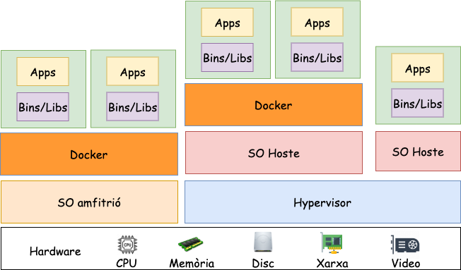

# Crides a sistema

## Que són les crides a sistema (System Calls)?

::: columns
::: {.column width="45%"}

Les **crides al sistema** ofereixen les funcions bàsiques per a poder utilitzar i interactuar amb els recursos del sistema de manera correcta i controlada.

### Nº de crides a sistema

* Linux: aprox. 300
* FreeBSD: aprox. 500
* Windows: aprox. 2000
  
:::
::: {.column width="45%"}

### Usos comuns

* Crear, obrir, tancar i eliminar fitxers.
* Crear i gestionar nous processos.
* Crear i gestionar la xarxa.

### Utilització

* Per accedir a les crides de sistema necessitem les **Llibreries del sistema**.
* Per exemple:
  * Unix: *stdio*,*stdlib*,*sys/shm*,...
  * Windows DLL: *system32.dll*, ..
:::
:::

## Quines són les principals crides a sistema?

|                         |            Windows           |   Unix   |
|-------------------------|:----------------------------:|:--------:|
| Control de processos    | CreateProcess()              | fork()   |
|                         | ExitProcess()                | exit()   |
|                         | WaitForSingleObject()        | wait()   |
| Manteniment & Informació| GetCurrentProcessID()        | getpid() |
|                         | SetTimer()                   | alarm()  |
|                         | Sleep()                      | sleep()  |
| Comunicació             | CreatePipe()                 | pipe()   |
| Protecció               | SetFileSecurity()            | chmod()  |
|                         | SetSecurityDescriptorGroup() | chown()  |
| Manipulació de fitxers  | CreateFile()                 | open()   |
|                         | ReadFile()                   | read()   |
|                         | WriteFile()                  | write()  |
|                         | CloseHandle()                | close()  |

## Exemple amb la llibreria (*stdio.h*)

{width="90%"}

# Nucli

## Què és el nucli d'un sistema operatiu?

El nucli del **SO** és la capa més crítica i conté les rutines de gestió  del sistema relacionades amb els recursos físic. Es troba sempre carregat a la Memòria.

### Funcionalitats del nucli

> * El nucli té la capacitat d'assignar i desassignar la CPU als usuaris i processos per evitar que acaparin el recurs de forma ininterrompuda.
> * El nucli evita que els usuaris i processos accedeixin a dades d'altres usuaris.
> * El nucli evita els usuaris modifíquin el codi i les dades del nucli.
> * El nucli evita que els usuaris realitzin E/S il·legals.

## Qué és la dualitat?

::: columns
::: {.column width="45%"}

### Mode kernel

* El codi que s'executa en aquest mode té accés a qualsevol adreça de Memòria i a tots els recursos hardware.
* Si un programa falla en aquest mode, tot el sistema quedarà aturat.

:::
::: {.column width="45%"}

### Mode usuari

* El codi no té accés directe a Memòria ni als recursos hardware.
* Si un programa falla en aquest mode, únicament atura el programa i no el sistema.

:::
:::

### Observació

En mode usuari la CPU comprova cada instrucció per comprovar que el procés pot realitzar-la. En el mode kernel s'executen sense cap comprovació de protecció.

## Com accedim al Kernel

:::center
{width=60%}
:::

:::center
**TRAPS** són mecanismes que permeten als processos d'aplicacions sol·licitar serveis del kernel. Un procés d'aplicació pot demanar funcions o operacions que només el kernel té permisos per realitzar.
:::

## Exemple de trap: `read(fd, buffer, nbytes)`

::: columns
::: {.column width="30%"}

[**Espai d'usuari**]{.alert}

1. Programa C:
   * Posa *fd, buffer, nbytes* als registres(*RDI,RSI,RDX*).
   * Crida a `read()`.

2. Llibreria de sistema:
   * Posa el codi de `read` a *RAX*.
   * Executa **syscall** (TRAP).

[**Transició a mode kernel**]{.alert}

:::
::: {.column width="30%"}

[**Espai del kernel**]{.alert}

* Crida al planificador de tasques.
* Localitza el handler de `read`.
* Executa el handler de `read`:
  * Llegeix dades del dispositiu d'E/S.
  * Col·loca les dades al buffer d'usuari.
* Retorna a l'espai d'usuari.

[**Transició a mode usuari**]{.alert}

:::
::: {.column width="30%"}

[**Espai d'usuari**]{.alert}

* **Llibreria de sistema**: Retorna el resultat de la crida a `read()` al Programa C.

* **Programa**: Continua l'execució utilitzant les dades llegides. O bé, tracta l'error si n'hi ha (*errno*)

:::
:::

## Què és una interrupció?

Les interrupcions són esdeveniments **hardware o software** asíncrons independents al procés que actualment s'està executant.

### Gestió

1. Guardar el context del procés actual.
2. Canviar a mode kernel.
3. Determinar la causa de la interrupció.
4. Buscar la direcció de la RTI.
5. Cridar a la RTI.
6. Restaurar el context del procés.
7. Tornar a mode usuari

&nbsp;

:::cbox
El seu tractament és **prioritari**.
:::

## Excepcions

Generalment són errors. Trencaments de la seqüència no previstos provocats per l'execució en curs de l'usuari (condició anormal mentre s'executa una instrucció.). El Sistema operatiu intenta tractar l'excepció si no pot solucionar el problema, s'enviarà un senyal al procés. El procés tracta el senyal executant el gestor per defecte o específic del procés per aquell senyal.

::: columns
::: {.column width="40%"}

### Faults

Un fault és un tipus d’excepció que s’informa abans de l’execució de la instrucció i que normalment es pot corregir. (per exemple, error de pàgina).
:::
::: {.column width="40%"}

### Traps

Una trap s’informa després de l’execució de la instrucció en què s’ha detectat l’excepció.  (per exemple, trap de depuració).
:::
::: {.column width="10%"}

### Aborts

Errors que no es poden corregir.
:::
:::

## Exemples d'excepcions

| Name                   | Type       |
|------------------------|------------|
| Divide-by-zero         | Fault      |
| Debug                  | Fault/Trap |
| Non-maskable Interrupt | Interrupt  |
| Breakpoint             | Trap       |
| Overflow               | Trap       |
| Bound Range Exceeded   | Fault      |
| Device not Available   | Fault      |
| Double Fault           | Abort      |
| Segment Not Present    | Fault      |
| Page Fault             | Fault      |

::: notes
Per a més informació podeu consultar el següent enllaç: [Excepcions](https://wiki.osdev.org/Exceptions).
:::

## Procediment general

:::center
{width=60%}
:::

## Com funciona la dualitat?

:::center
{width=80%}
:::

## Canvi de context (I)

:::center
{width=60%}
:::

## Canvi de context (II)

:::center
{width=60%}
:::

## Quines són les característiques de la dualitat

> * El codi que pertany al nucli sempre s'executa amb tots els privilegis (**mode supervisor**).
> * El *SO* minimitza el temps i el codi que s'executa aquest mode.
> * Per accedir al nucli necessitem realitzar un **canvi de context**.
> * Les **crides a sistema** permeten utilitzar les rutines del nucli.
> * **Instruccions privilegiades.** Totes les instruccions potencialment insegures estan prohibides quan s'executen en mode d'usuari.
> * **Protecció de memòria.** Tots els accessos a la memòria fora de la regió de memòria vàlida d'un procés estan prohibits quan s'executen en mode d'usuari. Transforma les referències lògiques (abstractes) en físiques (concretes).
> * **Interrupció del temporitzador.** Independentment del que faci el procés. El nucli pot recuperar periòdicament el control del procés actual. Errors que no es poden corregir.

## Exemples d'instruccions privilegiades

> * Assignació d'adreces de memòria.
> * Esborreu o invalideu la memòria cau de dades.
> * Invalideu les entrades a les taules de pàgines.
> * Carregueu i llegiu els registres del sistema.
> * Canvieu els modes de processador del nucli a l'usuari.
> * Canvieu el voltatge i la freqüència del processador.
> * Parar un processador.
> * Restableix un processador.
> * Fer operacions d'E/S.

# Estuctures dels sistemes operatius

## Quina és la problematica?

::: center
Quina és la millor manera d'organitzar/separar totes les parts del sistema operatiu?
:::

::: columns
::: {.column width="45%"}

### Reptes

* Com **organitzem** les parts?
* **Definició de polítiques**: Quines seran les accions a realitzar.
* Com **cooperen** les parts?
* **Mecanismes**: Com es duran a terme aquestes accions.

:::
::: {.column width="45%"}

### Classificació (Estructura Interna)

1. Monolítics
2. Capes
3. Micro-kernel
4. Híbrids
5. Màquines Virtuals

:::
:::

## Estructura simple

::: columns
::: {.column width="45%"}

### Característiques

* Estructura no ben definida.
* El **SO** és un conjunt de procediments que es poden cridar sense cap limitació.
* Son sistemes complexos; difícil d'implementar i de depurar.
* No tenen mode **dual**.
* Exemple: MS-DOS

:::
::: {.column width="45%"}

:::center

:::

:::
:::

::: notes
Els sistemes operatius com MS-DOS o Unix (original)  no tenien estructures ben definides.

No hi havia cap mode d’execució de la CPU (usuari i nucli), de manera que els errors en les aplicacions podrien provocar un bloqueig de tot el sistema.

Quan es va escriure DOS originalment, els seus desenvolupadors no tenien ni idea de quant de gran i important esdevindria. Va ser escrit per uns quants programadors en un temps relativament curt, sense el benefici de les tècniques modernes d’enginyeria de programari, i després va anar creixent amb el pas del temps fins a superar les seves expectatives originals. No divideix el sistema en subsistemes i no distingeix entre modes d’usuari i nucli, cosa que permet a tots els programes accedir directament al maquinari subjacent.
:::

## Estructura Monolítica

::: columns
::: {.column width="45%"}

### Característiques de l'estructura monolítica

Els serveis d'usuari i serveis del kernel s'implementen sota el mateix espai d'adreces.

::: center

:::

:::
::: {.column width="45%"}

### Pros de l'estructura monolítica

* Les funcionalitats (serveis) s'invoquen amb crides al sistema.
* Els controladors de dispositius es carreguen al nucli i passen a formar part del nucli.

### Cons de l'estructura monolítica

* Difícil d'entendre, modificar i mantenir.
* Poc fiable (sense aïllament entre els mòduls del sistema)

:::
:::

## Estructura per capes

::: columns
::: {.column width="50%"}

:::
::: {.column width="40%"}

### Pros de l'estructura per capes

* Independència entre les capes.
* Permet descriure el **SO** de forma clara.
* Simplicitat en la construcció i depuració.

### Cons de l'estructura per capes

* Rendiment.
* És difícil definir les capes a causa de les limitacions per comunicar-se.

:::
:::

::: notes

Un exemple és UNIX, aquest sistema operatiu, creat per Dennis Ritchie i Ken Thompson als anys 70, va adoptar una
arquitectura en capes més simple que Multics. Aquestes capes són: Hardware, Kernel, Shell i Aplicacions.
Un exemple és: NetBSD.

Permet que cada anell tingui un conjunt de funcions i responsabilitats clarament definides, i que cada anell pugui comunicar-se amb els anells adjaçents.

:::

## Estructura Microkernel

::: columns
::: {.column width="45%"}

### Característiques de l'estructura Microkernel

* Els serveis d'usuari i serveis del kernel s'implementi en diferents espais d'adreces.
* Comunicació entre els mòduls utilitza el pas de missatges.

### Pros de l'estructura Microkernel

* El kernel té una mida més reduïda.
* Portable, segur, fiable i extensible.

### Cons de l'estructura Microkernel

* Reducció de la velocitat d'execució i del rendiment.

:::
::: {.column width="45%"}

::: center

:::

:::
:::

:::notes

El sistema operatiu MacOS, desenvolupat per Apple, va aprofitar l’estabilitat i seguretat del nucli
Mach com a base per al seu sistema operatiu. En aquest sistema, serveis com la gestió de memòria, la gestió
de fitxers i la xarxa es van traslladar fora del nucli, a servidors externs, millorant la estabilitat, fiabilitat i
modularitat del sistema.

Sistemes en temps real com QNX, o dispotius encastats poden utilitzar aquesta arquitectura.
:::

## Comparativa Microkernel vs Monolític

::: center
{width="80%"}
:::

:::notes
El **microkernel** és més *lent* però més *segur i fiable* que el nucli **monolític**. El nucli **monolític** és *ràpid* però menys *segur*, ja que qualsevol fallada del servei pot causar un bloqueig del sistema.
:::

## Comparativa Microkernel vs Monolític vs Híbrids

::: center

:::

## Kernel Modular

::: definition-box
El serveis (*core*) estan integrats al kernel, la resta es poden carregar i descarregar de forma dinàmica.
:::

* No cal reiniciar per afegir nous mòduls.
* No cal implementar mecanismes de pas de missatges com en els microkernels.
* Qualsevol mòdul pot comunicar-se amb qualsevol altre.

{width="60%"}

:::notes
Els sistemes operatius modulars com  la majoria de sistemes operatius monolítics moderns com Linux, BSD,  poden carregar (i descarregar) dinàmicament mòduls executables en temps d’execució.

Aquesta modularitat del sistema operatiu és a nivell binari (imatge) i no a nivell d’arquitectura.

Pràcticament, carregar mòduls dinàmicament és simplement una manera més flexible de manejar la imatge del sistema operatiu en temps d'execució, en lloc de reiniciar-lo amb una imatge diferent del sistema operatiu.

Els mòduls permeten ampliar fàcilment les capacitats dels sistemes operatius segons sigui necessari.

Els mòduls que es poden carregar dinàmicament comporten una petita sobrecàrrega en comparació amb la incorporació del mòdul a la imatge del sistema operatiu.

Tanmateix, en alguns casos, carregar mòduls dinàmicament (segons calgui) ajuda a mantenir la quantitat de codi que s’executa a l’espai del nucli al mínim; per exemple, per minimitzar la petjada del sistema operatiu per a dispositius incrustats o aquells amb recursos de maquinari limitats. És a dir, no cal que un mòdul descarregat s’emmagatzemi en memòria d’accés aleatori escàs.
:::

## Exemple: Linux

::: columns
::: {.column width="50%"}

::: definition-box
El nucli Linux és un dels projectes de codi obert més grans del món, amb milers de desenvolupadors que aporten codi i milions de línies de codi canviats per a cada versió.
:::

* Arquitectura **Monolítica** híbrida basada en mòduls.
  * Enllaçat dinàmic.
  * Mòduls apilables.
* Disseny orientat a objectes.
* Suport per a múltiples fils d'execució.
* Suport per processament múltiple simètric.
* Abstracció hardware.

:::
::: {.column width="40%"}

::: center

:::

:::
:::

::: notes

Es distribueix sota la llicència GPLv2, que simplement esmenta, requereix que qualsevol modificació del nucli feta amb el programari que s’envia al client s’hagi de posar a la seva disposició (els clients), tot i que a la pràctica la majoria de les empreses posen el codi font a disposició del públic.

Per tal d’escalar el procés de desenvolupament, Linux utilitza un model de manteniment jeràrquic:

Linus Torvalds és el mantenidor del nucli Linux i fa merge dels **pull requests** de la comunitat.

La comunitat té un o més mantenidors que accepten *patches* de desenvolupadors, mantenint  el seu propi arbre git.

* Linux Torvalds: [git](git.kernel.org/pub/scm/linux/kernel/git/torvalds/linux-2.6.git)
* David Miller (treball en xarxa): [git](git.kernel.org/pub/scm/linux/kernel/git/davem/net.git/)
:::

## Màquines Virtuals

{width=80%}

::: center
JVM (Java Virtual Machine): Ens permet executar codi Java en qualsevol plataforma.
:::

## Contenidors

{width=80%}

## Exokernels

Arquitectura **minimalista** que intenta proporcionar als programes un control directe sobre el maquinari. A diferència dels microkernels o dels kernels monolítics, els exokernels no intenten abstraure gairebé res del maquinari, sinó que ofereixen primitives de baix nivell per accedir directament als recursos de la màquina. La gestió de recursos, com la memòria i la CPU, queda delegada als programes d’usuari o a les seves llibreries.

Imaginem que particionem una màquina en diferents màquines virtuals amb un subconjunt de recursos. Cada màquina virtual té un exokernel que li permet accedir directament als recursos de la màquina física. La idea és reduir el overhead del sistema separant la multiprogramació de les funcions del sistema operatiu en l’espai usuari.

::: notes
En aquest cas no estem movent instruccions de mode kernel a mode usuari, sinó que estem movent la gestió de recursos del sistema operatiu a l’espai d’usuari. De fet, els exokernels són tan petits que poden ser incrustats en aplicacions específiques. Per exemple, un exokernel podria ser incrustat en una aplicació de control de trànsit per coordinar els semàfors d’una ciutat.
:::

## Unikernels

Els unikernels són una forma de sistema operatiu que empaqueta tot el codi necessari per a una aplicació en un sol paquet. Aquest paquet s’executa directament sobre una màquina virtual o un hipervisor, sense cap sistema operatiu subministrat. Això permet als unikernels ser molt petits i molt eficients, ja que no hi ha cap codi innecessari.

S'inspiren en els contenidors, però en lloc d’executar-se en un sistema operatiu complet, s’executen directament sobre el hardware. Això els fa molt més petits i molt més eficients que els contenidors, ja que no hi ha cap sistema operatiu subministrat.

S'inspiren en els exokernels, però en lloc de proporcionar un conjunt de primitives de baix nivell per accedir directament als recursos de la màquina, proporcionen un conjunt de primitives de baix nivell per accedir directament als recursos de l’aplicació.

## Això és tot per avui

::: center
[**PREGUNTES?**]{.alert}

:::

::: columns
::: {.column width="50%"}

### Materials del curs

* **Organització**   --- [OS-GEI-IGUALADA-2425](https://github.com/OS-GEI-IGUALADA-2425)
* **Materials**    --- [Materials del curs](https://github.com/OS-GEI-IGUALADA-2425/materials)
* **Laboratoris**  --- [Laboratoris](https://github.com/OS-GEI-IGUALADA-2425/laboratoris)
* **Recursos**    --- [Campus Virtual](https://cv.udl.cat/)

[**TAKE HOME MESSAGE**]{.alert}: La dualitat i el disseny d'estructures eficients són crucials per a una gestió segura i òptima dels recursos i processos, garantint alhora un funcionament estable i eficaç dels dispositius informàtics.

:::
::: {.column width="45%"}

:::center
{width=40mm}
:::

:::
:::
