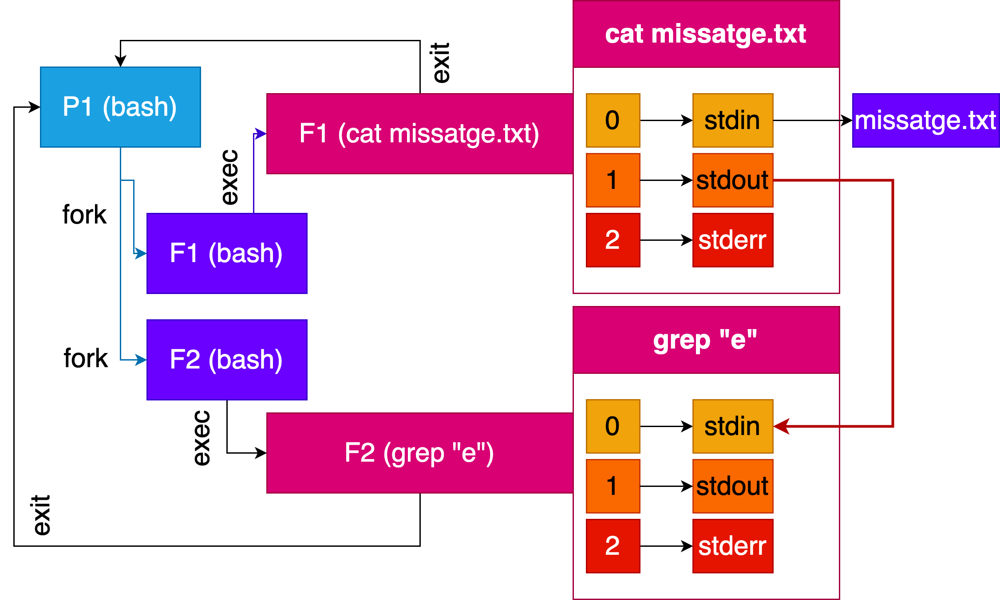
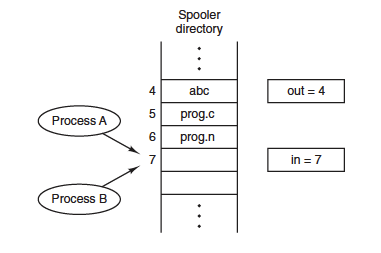
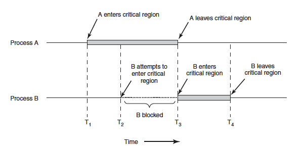
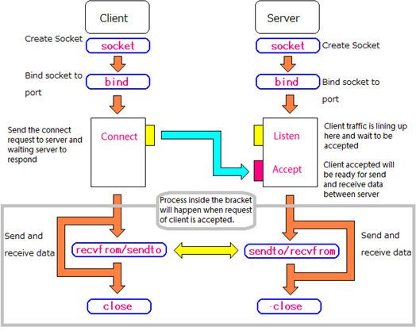

Introducció
============

Repàs de la gestió de processos
--------------------------------

```echo "Missatge enviat" > missatge.txt```


Comunicació entre processos (IPC)
---------------------------------

La **cooperació** i **comunicació** entre processos en sistemes operatius és essencial per a realitzar tasques complexes de manera eficient. En un sistema operatiu multiprogramat o distribuït, diversos processos poden col·laborar en el càlcul i realització de tasques compartint recursos i intercanviant informació.

::: example-box
En un [pipeline]{.alert}, la sortida d'un procés és la entrada d'un altre procés. Aquesta estructura facilita la comunicació i el processament de dades a través de múltiples etapes del flux de treball.
:::

És fonamental implementar un mecanisme estructurat i eficient de comunicació entre processos (IPC) per a garantir una col·laboració efectiva i coordinada entre les diferents entitats de processament..

Reptes de la comunicació (IPC)
--------

:::center
[**Els principals reptes són: la comunicació, sincronització i coordinació entre processos**]{.alert}.
:::

> 1. **Com es pot transferir la informació entre processos?**

  Recorda que els processos operen en espais [d'adreçes independents]{.alert}. Per tant, **no poden accedir a la mateixa informació** \blueArrow Transferència d'Informació entre Processos

> 2. **Com es pot assegurar que dos processos no intentin accedir simultàniament a la mateixa informació?**

  Imagina't 2 processos executant una reserva en un avió i els dos processos assignen el mateix seient a dos passatgers diferents. \blueArrow Evitar accés simultani a la mateixa informació.

> 3. **Com es poden coordinar els processos dependents entre si?**

  Imagina't un procés que genera dades i un altre procés que les processa. El procés que processa les dades necessita esperar a que el procés que les genera les hagi generat totes. \blueArrow Coordinar processos dependents.
 
Exemples de comunicació/sincronització entre processos
---------------------------------------

* **Comunicació**: Intercanvi d'informació.

```sh
cat missatge.txt | grep "e"
```

* **Sincronització**: Coordinació en l'accés als recursos i en l'ordre d'execució de les tasques.

```sh
echo "hola1"; echo "adeu1" && echo "hola2" || echo "adeu2"
```

::: notes

* El `;` permet executar les comandes de forma seqüencial.
* El `&&` permet executar la segona comanda si la primera s'ha executat correctament.
* El `||` permet executar la segona comanda si la primera no s'ha executat correctament.

:::

```cat < missatge.txt | grep "e"```
----------------------------------

{width="90%"}


Esquema de la comunicació/sincronització
--------------------------

::: columns
::: {.column width="45%"}
### Procés 1
```c
while(!FiTasca1){
  EsperarFiTasca1();
}

while(ExisteixTasca){
  dades = FerTasca2();
  EnviarMissatge(pid2,dades);
}
```
:::
::: {.column width="45%"}
### Procés 2
```c
RealitzarTasca1();
AvisarTasca1Completada();

while(ExisteixTasca){;
  RebreMissatge(pid2, &dades);
  RealitzarTasca(dades);
}
```
:::
:::

Exemple: Cua d'impressió
-------------------------

Assumeix que un proces A vol imprimir un document:

> 1. El *procés A* ha d'introduir el nom del fitxer a imprimir en una cua d'impressió.
> 2. El servei d'impressió *procés B* de forma periòdica revisa la cua d'impressió i imprimeix els fitxers que hi ha en la cua.

Per fer-ho, implementem una cua d'impressió amb dos variables una que apunta al següent slot a imprimir (**out**) i una al següent slot lliure (**in**).

Exemple: Cua d'impressió
-------------------------

::: columns
::: {.column width="60%"}

> - El procés A llegeix la variable **in** i escriu el valor 7 en una variable local (*next_free_slot*).
> - El SO interromp el procés A i executa el procés B.
> - El procés B llegeix la variable **in** i escriu el valor 7 en una variable local (*next_free_slot*).
> - El procés B col·loca un fitxer a la cua d'impressió al slot 7 i el servei d'impressió modifica les variables **in** i **out**.
> - El procés B realitza altres tasques no relacionades amb la cua d'impressió.
> - El SO interromp el procés B i executa el procés A. El procés A utilitza la seva variable local (*next_free_slot*) per a escriure el fitxer a la cua d'impressió. El fitxer s'escriu al slot 7, i també actualitza les variables **in** i **out**.
:::
::: {.column width="40%"}

{width="90%"}

### Observacions
> 1. El procés B ha perdut la impressió del fitxer. El procés A l'ha sobrescrit.
> 2. El servei d'impressió no ha notat cap inconsistencia en les variables **in** i **out**.

::: 
::: 

:::center
Aquest és un exemple de **[condició de carrera]{.alert}**.
:::

Condicions de carrera
---------------------

Les condicions de carrera es produeixen quan dos o més processos o fils d'execució intenten accedir simultàniament a recursos compartits o a dades sense la deguda sincronització.

### Riscos
Poden conduir a resultats inesperats o incorrectes en les operacions i a la inconsistència de les dades compartides.

### Solucions

> 1. **Exclusió Mútua**: Utilitzar mecanismes com semàfors, mutex o candaus per a garantir que només un procés pugui accedir als recursos compartits a la vegada.

> 2. **Sincronització**: Coordinar l'execució dels processos mitjançant sincronització de manera que no interfereixin entre ells quan accedeixen als recursos compartits.

Condicions per evitar les condicions de carrera
------------------------------------------------

La **secció crítica** és la part del codi on s'accedeix a recursos compartits. Per a evitar les condicions de carrera, els processos han de complir les següents condicions:

1. Dos processos no poden estar simultàniament en la secció crítica.
2. No s'ha d'assumir que els processos són executats de forma ràpida o lenta.
3. Cap procés que no estigui en la secció crítica pot bloquejar altres processos.
4. Cap procés ha d'esperar per sempre per entrar a la secció crítica.

{width="70%"}


Tipus de comunicació
--------------------

::: columns
::: {.column width="50%"}
### Pas de missatges
> - Permet integrar tasques de comunicació i sincronització entre processos situats en una mateixa màquina o en màquines distribuïdes.
> - Un missatge és un conjunt de dades intercanviades per 2 o més processos.

:::
::: {.column width="50%"}
### Memòria compartida
> - Els processos es comuniquen utilitzant variables o zones de memòria compartida.
> - S'utilitzen per comunicar processos en una mateixa màquina.
> - Es necessita regular l'accés a la informació compartida per garantir el resultat òptim i evitar les *race conditions*.
:::
:::

Característiques de la comunicació
---------------------------------

::: columns
::: {.column width="45%"}
### Identificació
* Mecanismes de noms
    - Sense nom
    - Nom local
    - Nom de la red

* Identificador de destí
    - **Directe**: S'ha d'indicar el procés origen i destí. El missatge s'envia a un procés concret utilitzant el seu *pid*. El receptor pot (indicar o no) el procés que vol rebre el missatge.
    - **Indirecte**: Els missatges s'envien a una zona contreta (bustia o port), sense identificar de forma explícita el destí.
:::
::: {.column width="45%"}
### Flux de dades
> - Unidireccional
> - Bidireccional

### Buffering
> - Amb buffers
> - Sense buffers

### Sincronització
> - Sincrons (bloquejants)
> - Asíncrons (no bloquejants)
:::
:::


Tipus de mecanismes
-------------------

1. Fitxers.
2. Pipes.
3. FIFOS (Pipes amb nom).
4. Cues de missatges.
5. Sockets.
6. Memòria compartida (IPC).

Fitxers
----------------------------------

La comunicació entre processos a través dels s**istemes de fitxers** és una manera simple d'intercanviar informació entre ells. Això implica que [dos o més processos acorden un fitxer pel seu nom i el utilitzen per a la comunicació]{.alert}. Un dels processos escriu al fitxer mentre que un altre processos llegeix el contingut del fitxer.

### Limitacions

> - **Persistència**: Els fitxers són persistents, la informació roman en disc fins que s'elimina de forma explícita. Això no és òptim per a la comunicació efímera o temporal entre processos.

> - **Problemes de Sincronització**: Cal gestionar la sincronització de forma manual per garantir que un procés no llegeixi el fitxer abans que un altre procés hagi acabat d'escriure-hi. Aquesta sincronització pot ser complexa i pot conduir a errors si no es gestiona adequadament.

> - **Eficiència**: L'ús de fitxers per a la comunicació no és eficient en termes de rendiment, ja que involucra operacions d'entrada i sortida a disc, que són més lentes que altres mètodes de comunicació en memòria.


Exemple: Comunicació amb fitxers
--------------------------------

```c
// Process 1 (escriptor)
int fd = open("fitxer_comunicacio.txt", O_WRONLY | O_CREAT, 0644);
write(fd, "Missatge des de Process 1", strlen("Missatge des de Process 1"));
close(fd);
```

```c
// Process 2 (lector)
int fd = open("fitxer_comunicacio.txt", O_RDONLY);
char buffer[100];
read(fd, buffer, 100);
close(fd);
printf("Missatge rebut: %s\n", buffer);
```

Pipes
-----

Els **pipes** són dispositius lògics dissenyats per permetre la comunicació entre processos. Es comporten com una cua de caràcters amb una longitud fixa on els processos poden llegir i escriure.

> - **Sense Nom**: Els pipes són anònims, el que significa que no estan associats amb un fitxer del sistema de fitxers.
> - **Ús Amb fork()**: Els pipes són particularment útils entre processos que comparteixen un pare, ja que es poden heretar i utilitzar fàcilment.
> - **Identificació**: Es caracteritzen per tenir dos descriptors de fitxers, un per a l'escriptura i un altre per a la lectura.
> - **Flux de Dades Unidireccional**: El flux de dades als pipes és unidireccional, la informació només es mou d'una direcció, és a dir, del procés escriptor al procés lector.
> - **Amb Buffering**: Els pipes utilitzen un mecanisme que permet acumular dades fins que es llegeixin.
> - **Restriccions d'Àmbit Local**: Els pipes normalment s'utilitzen per a la comunicació entre processos a la mateixa màquina, ja que no estan dissenyats per a la comunicació a través de xarxes.

Exemple: Comunicació amb Pipes (Bash)
--------------------------------

```sh
echo "Missatge des de Process Pare" | echo "Missatge rebut: $(cat)"
```


Exemple: Comunicació amb pipes
--------------------------------

::: columns
::: {.column width="60%"}
```c
int pipe_fd[2];
pipe(pipe_fd);
if (fork() == 0) { // Fill (lector)
  close(pipe_fd[1]);
  char buffer[100];
  read(pipe_fd[0], buffer, 100);
  close(pipe_fd[0]);
  printf("Missatge rebut: %s\n", buffer);
} else { // Pare (escriptor)
  close(pipe_fd[0]);
  write(pipe_fd[1], 
  "Missatge des de Process pare", 
  strlen("Missatge des de Process pare")
  );
  close(pipe_fd[1]);
}
```
:::
::: {.column width="40%"}
{width="90%"}
:::
:::


FIFOS
-----------

* Funcionen com els **pipes**, però amb un mecanisme de comunicació amb nom.
* Serveis:
  * ```mkfifo(char *name,mode_t mode)```;
  * ```open(char *name, int flag)```;
    * S'obre un FIFO per r,w, r+w
    * Acció bloquejant fins que algun procés estigui a l'altre extrem.
  * Lectura i escriptura (*read()*, *write()*).
  * Tancament amb *close()*.
  * Eliminació amb *unlink()*.

::: center
Els **FIFOs** ofereixen una forma de comunicació més flexible entre processos amb l'avantatge afegit de poder ser utilitzats per processos que no comparteixen un antecessor comú.
:::

Exemple: Comunicació amb FIFOS (Bash)
--------------------------------

1. Crear el FIFO en la terminal 1:

```sh
mkfifo fifo_example
```

2. Executarem el process 1 (escriptor) a la terminal 1:

```sh
echo "Missatge des de Process 1" > fifo_example
```

3. Executarem el process 2 (lector) a la terminal 2:

```sh
cat < fifo_example
```

4. Eliminarem el FIFO:

```sh
rm fifo_example
```


Exemple: Comunicació amb FIFOS (C)
--------------------------------

```c
mkfifo("fifo_example", 0666);

// Process 1 (escriptor)
int fd = open("fifo_example", O_WRONLY);
write(fd, "Missatge des de Process 1", strlen("Missatge des de Process 1"));
close(fd);

// Process 2 (lector)
int fd = open("fifo_example", O_RDONLY);
char buffer[100];
read(fd, buffer, 100);
close(fd);
printf("Missatge rebut: %s\n", buffer);


unlink("fifo_example");
```


Cua de missatges
---------------------

> - Comunicació mitjançant pas de missatge de la llibreria IPC.
> - Mateixa màquina.
> - Identificació: indirecta amb identificador especial **idCua**.
> - Amb nom local.
> - Amb buffering.
> - Unidireccional.
> - Sincronització: bloquejant i no bloquejant.

### Operacions bàsiques:

> - [int msgsnd(int msqid, const void *msgp, size_t msgsz, int msgflg)]{.alert}: Envia un missatge *msgp* de mida *msgz* a la cua *msgid*.

> - [ssize_t msgrcv(int msqid,void *msgp, size_t msgsz,long msgtyp,int msgflg)]{.alert}: Rep un missatge de la cua *msgid* i el guarda a *msgp*.


Exemple: Comunicació amb Cua de missatges (C) - Escriptor
--------------------------------

```c
struct message {
    long msg_type;
    char msg_text[100];
};

int main() {
    key_t key = ftok("msg_queue_example", 65);
    int msqid = msgget(key, 0666 | IPC_CREAT);
    struct message msg;
    msg.msg_type = 1;
    strcpy(msg.msg_text, "Aquest és un missatge de prova!");
    msgsnd(msqid, &msg, sizeof(msg), 0);
    printf("Missatge enviat: %s\n", msg.msg_text);
    return 0;
}
```

Exemple: Comunicació amb Cua de missatges (C) - Lector
--------------------------------

```c
struct message {
    long msg_type;
    char msg_text[100];
};

int main() {
    key_t key = ftok("msg_queue_example", 65);
    int msqid = msgget(key, 0666 | IPC_CREAT);
    
    struct message msg;
    msgrcv(msqid, &msg, sizeof(msg), 1, 0);
    printf("Missatge rebut: %s\n", msg.msg_text);
    return 0;
}
```

Sockets
----------

Els **sockets** són eines fonamentals per a la comunicació entre processos a través d'una xarxa o dins del mateix ordinador. Poden utilitzar-se per a la comunicació mitjançant diferents protocols com *TCP/IP* o *UDP*.

> - **Comunicació a través de la xarxa o local**: Els sockets permeten la comunicació entre processos que poden estar en el mateix ordinador o en diferents ordinadors a través de la xarxa.

> - **Adreces**: Els sockets estan identificats per adreces, com les adreces IP per a la comunicació a través de xarxes o adreces locals per a comunicació dins del mateix ordinador.

> - **Protocols**: Els sockets poden utilitzar diferents protocols com TCP/IP o UDP, segons les necessitats de la comunicació.

Exemple: Comunicació amb Sockets
--------------------------------

{width="70%"}


Exemple: Comunicació amb Sockets (C) 
--------------------------------

::: columns
::: {.column width="50%"}
### Servidor
```c
int sockfd, new_sock;
struct sockaddr_in server_addr;
struct  sockaddr_in new_addr;
socklen_t addr_size;
char buffer[100];

sockfd=socket(AF_INET, SOCK_STREAM, 0);
// Configuració de la connexió...
// Esperar connexions i llegir
new_sock = accept(sockfd, 
(struct sockaddr*)&new_addr, 
&addr_size);
recv(new_sock, buffer, 100, 0);
printf("Missatge rebut: %s\n", buffer);
```

:::
::: {.column width="50%"}
### Client
```c
int sockfd;
struct sockaddr_in server_addr;
char buffer[100];

sockfd=socket(AF_INET, SOCK_STREAM, 0);
// Configuració de la connexió...

// Enviar missatge al servidor
send(sockfd,"Missatge des del client",
strlen("Missatge des del client"), 0);
```
:::
:::


Memòria compartida
------------------------

La comunicació mitjançant **memòria compartida** implica compartir una àrea de memòria entre diferents processos o fils d'execució d'un mateix procés. Aquest àrea de memòria és accessible per a tots els fils d'execució involucrats, permetent un accés directe i eficient a les dades compartides.

### Observacions
> * **Espai d'adreçament únic**: Fils d'execució d'un procés.
> * **Múltiples espai d'adreces**: Zones de Memòria que són accessibles per processos diferents.
> * *S'ha de controlar/sincronitzar* l'accés a les **dades compartides** per assegurar la consistència de les dades amb mecanismes com semàfors, mutex o candaus.

Exemple: Comunicació amb Memòria Compartida (C)
--------------------------------

```c
key_t key = ftok("fitxer_clau", 'R');
int shmid = shmget(key, 1024, 0666 | IPC_CREAT);
char *shared_memory = (char *)shmat(shmid, (void *)0, 0);

// Escriure dades a la memòria compartida
strcpy(shared_memory, "Missatge a la memòria compartida");

// Llegir dades de la memòria compartida
printf("Missatge llegit: %s\n", shared_memory);

// Alliberar memòria compartida
shmdt((void *)shared_memory);
shmctl(shmid, IPC_RMID, NULL);
```

Memòria compartida llibreries
--------------------------------

> - **pthread (POSIX Threads)**: És una interfície estàndard que facilita la creació i gestió de fils d'execució (threads) en C. Permet als processos tenir múltiples fils d'execució que comparteixen memòria i recursos.

> - **OpenMP**: És una API que facilita la programació paral·lela. Permet als desenvolupadors marcar parts del codi com a regions paral·leles, que s'executaran de forma concurrent en diferents fils d'execució.

Comparació/Selecció de mecanismes de comunicació
--------------------------------

> - **Fitxers**: Comunicació temporal de dades. [No recomanat]{.alert}.
> - **Pipes**: Comunicació *unidireccional* entre processos amb un antecessor comú.
> - **FIFOS**: Comunicació *unidireccional* entre processos amb un antecessor comú.
> - **Cues de missatges**: Quan es necessita enviar missatges amb sincronització asíncrona i buffering.
> - **Sockets**: Comunicació a través de la xarxa o local.
> - **Memòria compartida**: Quan es necessita accedir ràpidament a dades compartides entre processos.

## Això és tot per avui

::: center
[**PREGUNTES?**]{.alert}

:::

::: columns
::: {.column width="50%"}

### Materials del curs

* **Organització**   --- [OS-GEI-IGUALADA-2425](https://github.com/OS-GEI-IGUALADA-2425)
* **Materials**    --- [Materials del curs](https://github.com/OS-GEI-IGUALADA-2425/materials)
* **Laboratoris**  --- [Laboratoris](https://github.com/OS-GEI-IGUALADA-2425/laboratoris)
* **Recursos**    --- [Campus Virtual](https://cv.udl.cat/)

[**TAKE HOME MESSAGE**]{.alert}: La comunicació entre processos en sistemes operatius implica l'ús de mecanismes diversos com pipes, FIFOS, cues de missatges, sockets i memòria compartida, cada un amb avantatges i contextos d'ús específics per a garantir una interacció efectiva i coordinada.

:::
::: {.column width="45%"}

:::center
{width=40mm}
:::

:::
:::


