Creació de processos
====================

Com és creen els processos?
----------------------------

::: columns
::: {.column width="45%"}

### ```fork()```
La crida a sistema *fork()* crea un nou procés.

###
El procés **A(pare)** i [**A(fill)**]{.alert} són una *còpia exacta* en el moment inicial (*fork()*).

> - Tenen el mateix valor al registre *PC*.
> - Comparteixen fitxers oberts.
> - Comparteixen registres de cpu.
> - Els valors inicials de les variables locals són els que tenien en el moment de la creació del fill \blueArrow excepte el valor que retorna el fork.

:::
::: {.column width="50%"}

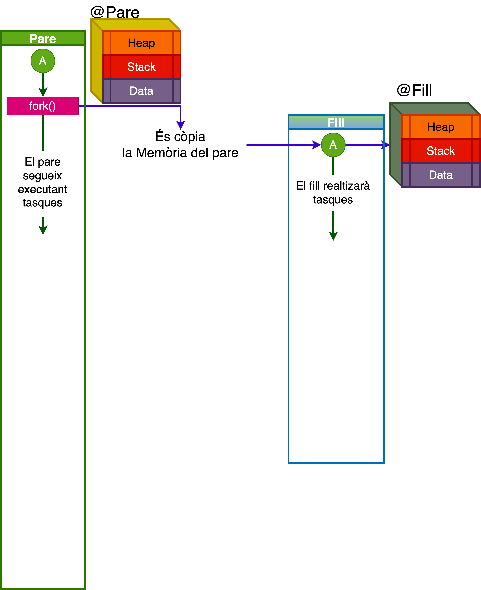{width="90%"}

:::
:::

Com és creen el processos?
--------------------------

::: columns
::: {.column width="45%"}

```c
#include <unistd.h>
pid_t fork(void);
```

> - Si *fork()* té èxit, al procés **pare**, retorna un valor **$>0$** i aquest [enter positiu]{.alert} equival a la identificació del [**procés fill**]{.alert}.
> - Si *fork()* té èxit, al procés [**procés fill**]{.alert}, retorna el valor **0**.
> - Si *fork()* falla, al procés **pare**, retorna un valor  **$<0$** i el codi d'error s'emmagatzema a *errno*. 
> - Tingueu en compte que si *fork()* falla, no hi ha cap [**procés fill**]{.alert}.

:::
::: {.column width="45%"}

```c
pid_t childPid;      
switch (childPid = fork()) { 
   case -1: 
   /* fork() failed */  
   /* Handle error */ 
   case 0:  
   /* Child of successful fork() 
      comes here */  
   /* Perform actions specific 
      to child */ 
   default: 
   /* Parent comes here after 
    successful fork() */ 
   /* Perform actions specific 
      to parent */ 
}
```
:::
:::


Com és creen els processos?
----------------------------

::: columns
::: {.column width="45%"}

### 
> * El procés **A(pare)** i [**A(fill)**]{.alert}  no comparteixen *espai de Memòria* (codi, dades, variables).
> * Després de l’execució de *fork()* no es pot assegurar a quin d’ambdós processos, **pare** o [**(fill)**]{.alert}, s’assignarà la CPU.

### 
```c
#include <sys/types.h>
#include <unistd.h>
//retorna el pid del procés actual.
pid_t getpid(void);  
//retorna el pid del procés pare
pid_t getppid(void); 
```

:::
::: {.column width="45%"}

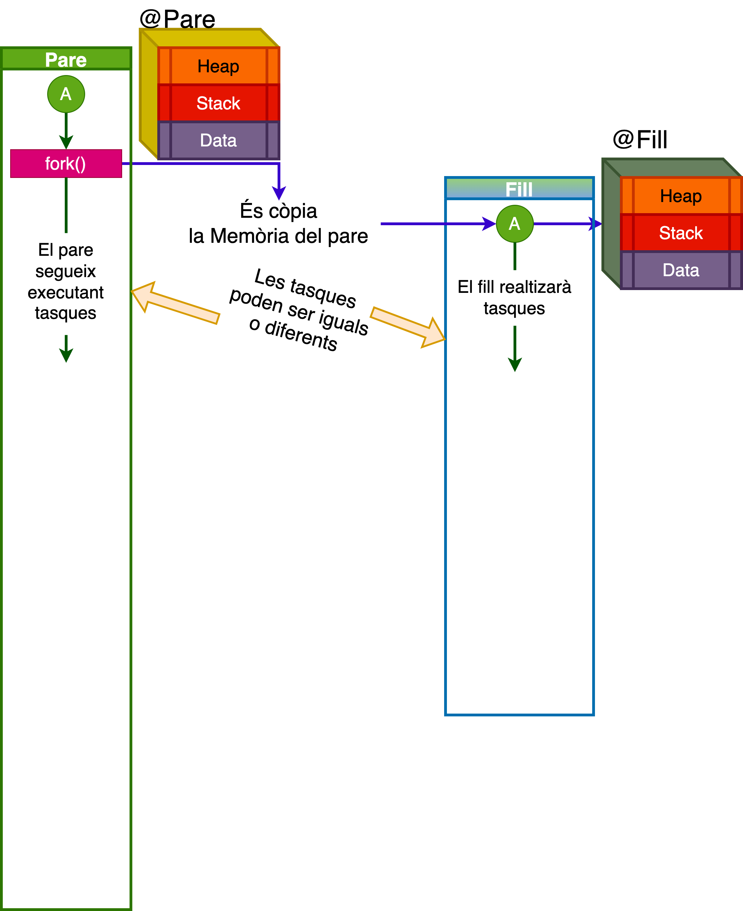{width="90%"}

:::
:::


Exemple 1: Propietats dels processos (Data,Heap,Stack)
------------------------------------------------

::: columns
::: {.column width="55%"}

```{.c size="tiny"}
static int i = 11; //Allocated in data segment
int main() {
    int j= 22; // Allocated in stack
    int *z = malloc(sizeof(int)); // Allocated in heap

	pid_t pid;
	switch (pid=fork())
    {
    case 0:
        i *= 3; 
        j *= 3;
        *z=44;
        break;

    default:
        sleep(3);
        *z=55;
        break;
    }
    /* Both parent and child come here */  
    printf("PID=%ld %s data=%d stack=%d heap=%d\n", 
        (long) getpid(), (pid == 0) ? "(child) " : "(parent)", i, j, *z);
    return EXIT_SUCCESS;
}
```

:::
::: {.column width="45%"}

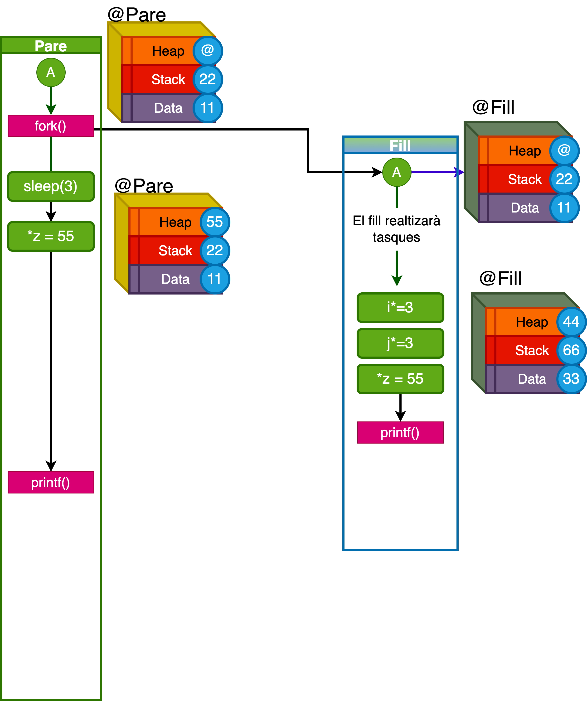{width="90%"}

:::
:::


Exemple 2: Propietats dels processos (Buffers)
--------------------------------------------

::: columns
::: {.column width="45%"}

### ./forkbuf
```{.c size="tiny"}
int g = 0;
int
main() {
	pid_t pid;
	int l = 1;
	printf("before fork\n");

	if ((pid = fork()) < 0) {
		err(EXIT_FAILURE, "fork error");
		/* NOTREACHED */
	} else if (pid == 0) {	/* child */
		g++;
		l++;
	} else {		/* parent */
		sleep(3);
		g--;
		l--;
	}

	printf("pid = %d, ppid = %d, g = %d, l = %d\n",
			getpid(), getppid(), g, l);
	return EXIT_SUCCESS;
}
```


:::
::: {.column width="45%"}

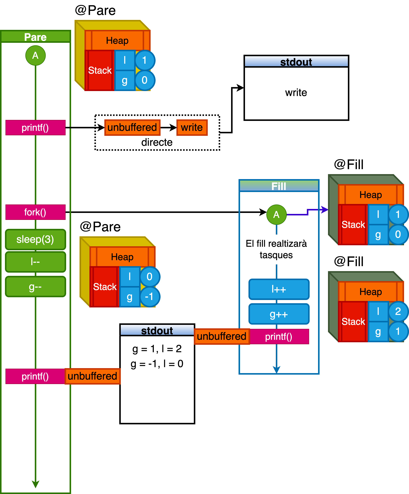{width="90%"}

:::
:::


Exemple 2: Propietats dels processos (Buffers)
--------------------------------------------

::: columns
::: {.column width="45%"}

### ./forkbuf > a.txt
```{.c size="tiny"}
int g = 0;
int
main() {
	pid_t pid;
	int l = 1;
	printf("before fork\n");

	if ((pid = fork()) < 0) {
		err(EXIT_FAILURE, "fork error");
		/* NOTREACHED */
	} else if (pid == 0) {	/* child */
		g++;
		l++;
	} else {		/* parent */
		sleep(3);
		g--;
		l--;
	}

	printf("pid = %d, ppid = %d, g = %d, l = %d\n",
			getpid(), getppid(), g, l);
	return EXIT_SUCCESS;
}
```


:::
::: {.column width="45%"}

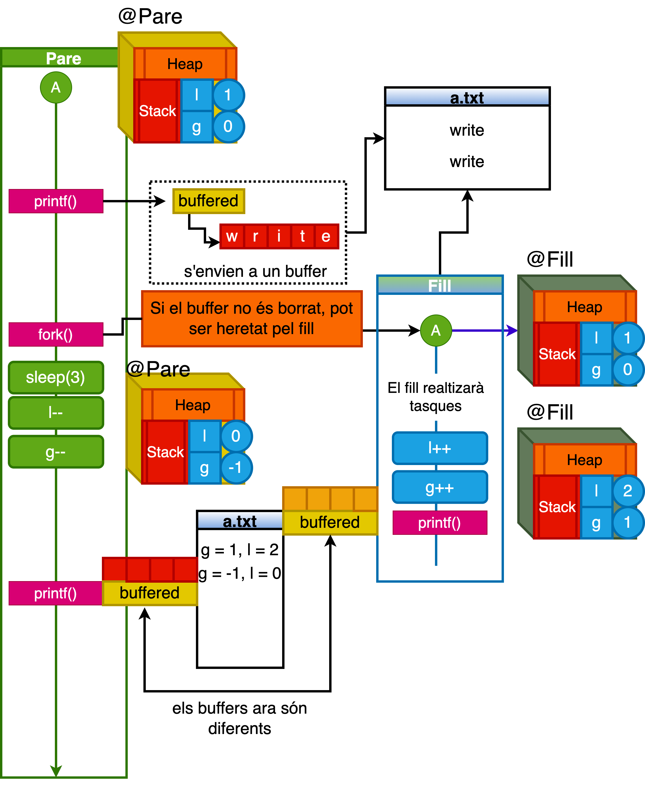{width="90%"}

:::
:::


Exemple 2: Propietats dels processos (Buffers)
--------------------------------------------

::: columns
::: {.column width="45%"}

### ./forkbuf > a.txt
```{.c size="tiny"}
int g = 0;
int
main() {
	pid_t pid;
	int l = 1;
	printf("before fork\n");
    fflush(stdout); //forcem que el buffer es buidi
	if ((pid = fork()) < 0) {
		err(EXIT_FAILURE, "fork error");
		/* NOTREACHED */
	} else if (pid == 0) {	/* child */
		g++;
		l++;
	} else {		/* parent */
		sleep(3);
		g--;
		l--;
	}

	printf("pid = %d, ppid = %d, g = %d, l = %d\n",
			getpid(), getppid(), g, l);
	return EXIT_SUCCESS;
}
```


:::
::: {.column width="45%"}

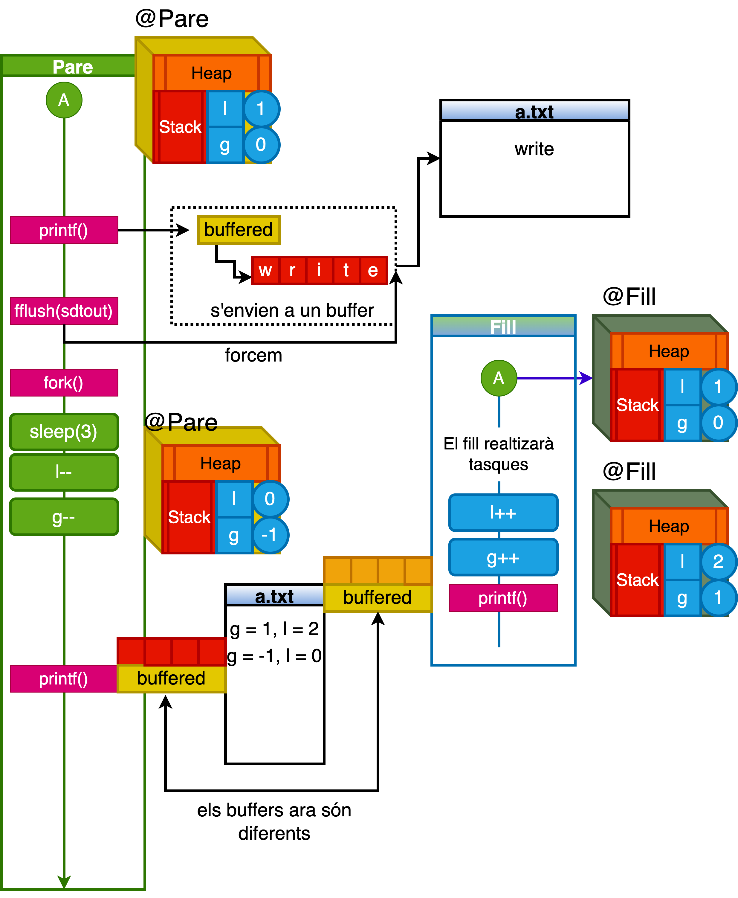{width="90%"}

:::
:::

Sincronització de processos *wait()*
-----------------------------------

::: columns
::: {.column width="45%"}

La crida a sistema *wait()* bloqueja el procés fins que acaba un dels processos secundaris o es rep un senyal. 


```c
#include <sys/wait.h>
// Es retorna el pid del procés.
// o -1 en cas d’error.
pid_t wait(int *status);
```

::: example-box
El procés **A (Pare)** suspèn la seva execució fins la finalització del procés [**A (fill)**]{.alert}.
:::

:::
::: {.column width="45%"}

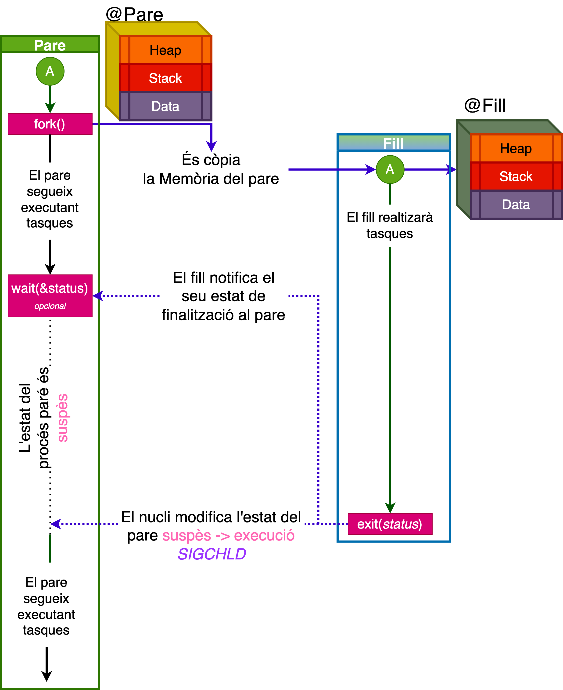{width="90%"}

:::
:::


Exemple: Sincronització de processos 
-------------------------------------

::: columns
::: {.column width="45%"}

### Amb sincronització

```{.c size="tiny"}
int status;		
pid_t child_pid;
int main() {
pid_t pid;
if ((pid = fork()) < 0) {
	err(EXIT_FAILURE, "fork error");
} else if (pid == 0) {	
	printf("pid = %d, ppid = %d, -> %s\n",
	  getpid(), getppid(), 
      "My name is Rhaenyra daughter of King Viserys I");
       exit(0);
} else {
	child_pid = wait(&status);
    printf("pid = %d, -> %s (%d)\n",
		getpid(), 
        "My name is King Viserys and I known 
          that Rhaenyra finished her job.",
        child_pid);
	}
pid_t child_pid = wait(&status);
printf("pid = %d, -> %s (%d)\n",
	getpid(), 
    "My name is King Viserys and I am sad... 
      I have no more child working... :(",
    child_pid);
	return EXIT_SUCCESS;
}
```

:::
::: {.column width="45%"}

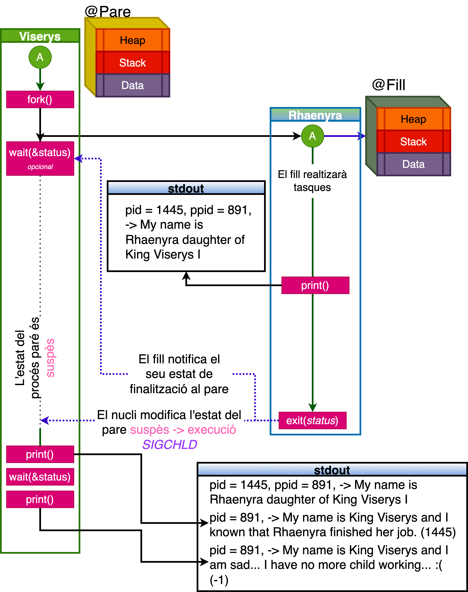{width="90%"}

:::
:::

Exemple: Sincronització de processos 
-------------------------------------

::: columns
::: {.column width="45%"}

### Sense sincronització

```{.c size="tiny"}
int status;		
pid_t child_pid;

int
main() {
pid_t pid;
if ((pid = fork()) < 0) {
	err(EXIT_FAILURE, "fork error");
} else if (pid == 0) {	
	printf("pid = %d, ppid = %d, -> %s\n",
	  getpid(), getppid(), 
      "My name is Rhaenyra daughter of King Viserys I");
} else {
    printf("pid = %d, -> %s (%d)\n",
		getpid(), 
        "My name is King Viserys and I do not known 
          that Rhaenyra finished her job.",
        child_pid);
	}
pid_t child_pid = wait(&status);
printf("pid = %d, wait-> %s (%d)\n",
	getpid(), 
    child_pid);
return EXIT_SUCCESS;
}
```

:::
::: {.column width="45%"}

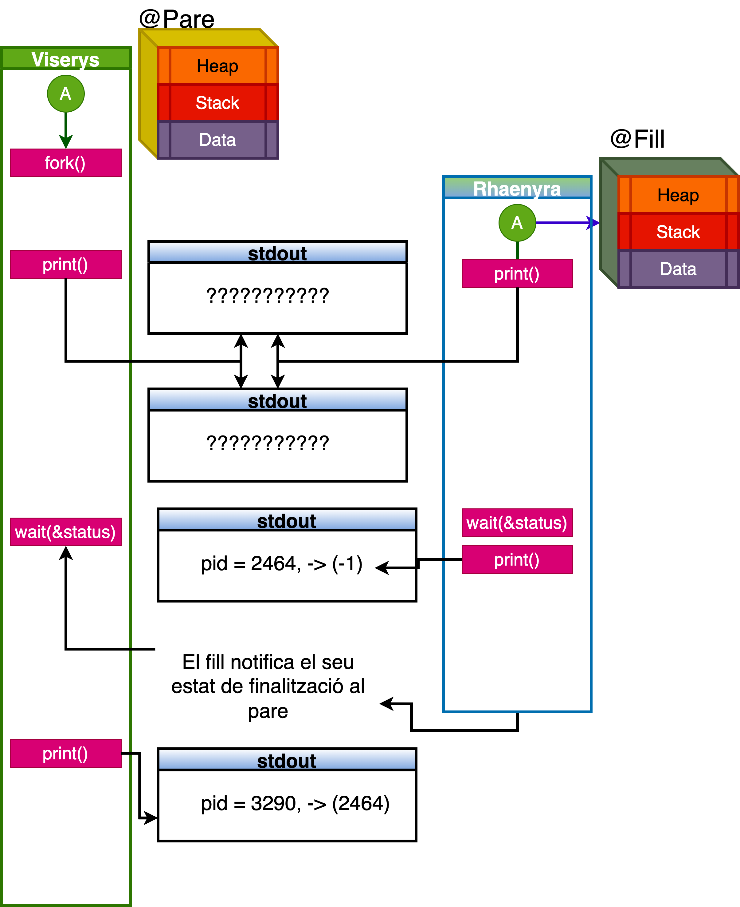{width="90%"}

:::
:::

waitpid
--------


::: columns
::: {.column width="45%"}

La crida a sistema *waitpid()* bloqueja el procés fins que acaba el procés identificat per *pid* o es rep un senyal. 

```c
#include <sys/wait.h>
// Es retorna el pid del procés.
// o -1 en cas d’error.
pid_t waitpid(pid_t pid, 
              int *status, 
              int options);
```

::: example-box
La crida *wait()* és equivalent a [**waitpid(-1, &status,0)**]{.alert};
:::

:::
::: {.column width="45%"}

### Argument *pid*
> * [**$<-1$**]{.alert}: Esperar qualsevol procés fill l'identificador del grup de processos del qual sigui igual al valor absolut de pid.
> * [**$-1$**]{.alert}: Significa esperar qualsevol procés secundari.
> * [**$0$**]{.alert}:  Esperar qualsevol procés fill l'identificador del grup de processos del qual sigui igual al del procés.
> * [**$>0$**]{.alert}: Esperar pel procés identificat amb el pid (**$>0$**).

:::
:::


Macros **wait/waitpid**
------------------------

Si *status* no és NULL, **wait() i waitpid()** emmagatzemen informació d'estat a l'int al qual apunta. Aquest nombre sencer es pot inspeccionar amb:

::: columns
::: {.column width="40%"}

> * **WIFEXITED(status))**: Indicador si el fill acaba de forma normal.
> * **WEXITSTATUS(status))**: Retorna l'estat de sortida del fill. 
> * **WIFSIGNALED(status))**: Indicador si el fill ha estat acabat per un senyal. 
> * **WIFSIGNALED(status))**: Retorna el número del senyal que ha provocat la finalització del procés fill.

:::
::: {.column width="50%"}

> * **WCOREDUMP(status))**: Indicador si el fill acaba per un *core dumped* al nucli. (no esta disponible a totes les versions de UNIX)
> * **WIFSTOPPED(status))**: Indicador de suspensió del fill requereix l'opció (*WUNTRACED*). 
> * **WSTOPSIG(status))**: Retorna el número de senyal que ha aturat el fill.
> * **WIFCONTINUAT(status))**: Indicador que el fill torna a arrancar amb *SIGCONT*. (disponible al kernel de linux superior a 2.6).

:::
:::


Exemple: waitpid.c (signals)
-----------------

::: columns
::: {.column width="60%"}


```{.c size="tiny"}
int main(int argc, char *argv[])
{
pid_t pid, w;
int status;
pid = fork();
if (pid == -1) {
    perror("fork"); exit(EXIT_FAILURE);
}
if (pid == 0) {            /* Code executed by child */
    printf("Child PID is %d\n", getpid());
    if (argc == 1)
        pause();                    /* Wait for signals */
    exit(atoi(argv[1]));
} else {                    /* Code executed by parent */
    do {
        w = waitpid(pid, &status, WUNTRACED | WCONTINUED);
        if (w == -1) {
            perror("waitpid"); exit(EXIT_FAILURE);
        }
        if (WIFEXITED(status)) {
            printf("exited, [%d] status=%d\n", pid, WEXITSTATUS(status));
        } else if (WIFSIGNALED(status)) {
            printf("killed by signal, [%d] -> %d\n", pid, WTERMSIG(status));
        } else if (WIFSTOPPED(status)) {
            printf("stopped by signal [%d] -> %d\n", pid, WSTOPSIG(status));
        } else if (WIFCONTINUED(status)) {
            printf("continued\n");
        }
    } while (!WIFEXITED(status) && !WIFSIGNALED(status));
    exit(EXIT_SUCCESS);
}
```

:::
::: {.column width="40%"}

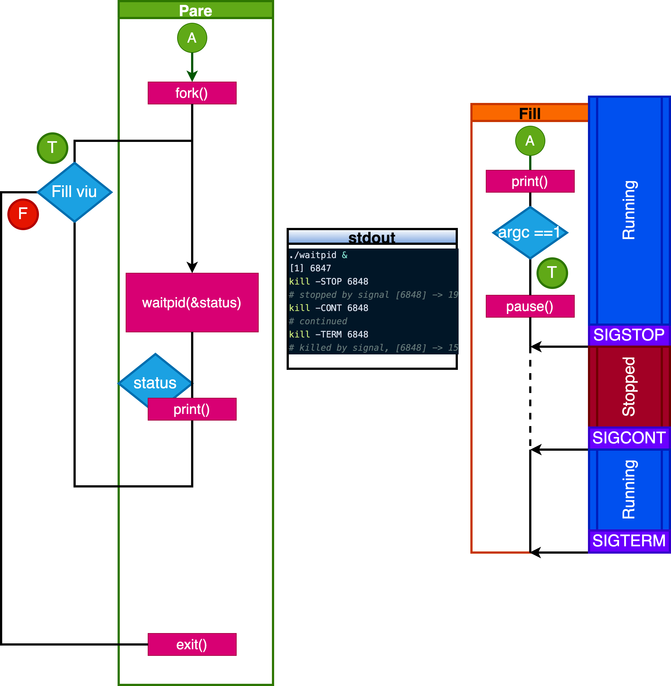{width="90%"}

:::
:::


Exemple: waitpid.c (exit)
-----------------

::: columns
::: {.column width="60%"}


```{.c size="tiny"}
int main(int argc, char *argv[])
{
pid_t pid, w;
int status;
pid = fork();
if (pid == -1) {
    perror("fork"); exit(EXIT_FAILURE);
}
if (pid == 0) {            /* Code executed by child */
    printf("Child PID is %d\n", getpid());
    if (argc == 1)
        pause();                    /* Wait for signals */
    exit(atoi(argv[1]));
} else {                    /* Code executed by parent */
    do {
        w = waitpid(pid, &status, WUNTRACED | WCONTINUED);
        if (w == -1) {
            perror("waitpid"); exit(EXIT_FAILURE);
        }
        if (WIFEXITED(status)) {
            printf("exited, [%d] status=%d\n", pid, WEXITSTATUS(status));
        } else if (WIFSIGNALED(status)) {
            printf("killed by signal, [%d] -> %d\n", pid, WTERMSIG(status));
        } else if (WIFSTOPPED(status)) {
            printf("stopped by signal [%d] -> %d\n", pid, WSTOPSIG(status));
        } else if (WIFCONTINUED(status)) {
            printf("continued\n");
        }
    } while (!WIFEXITED(status) && !WIFSIGNALED(status));
    exit(EXIT_SUCCESS);
}
```

:::
::: {.column width="40%"}

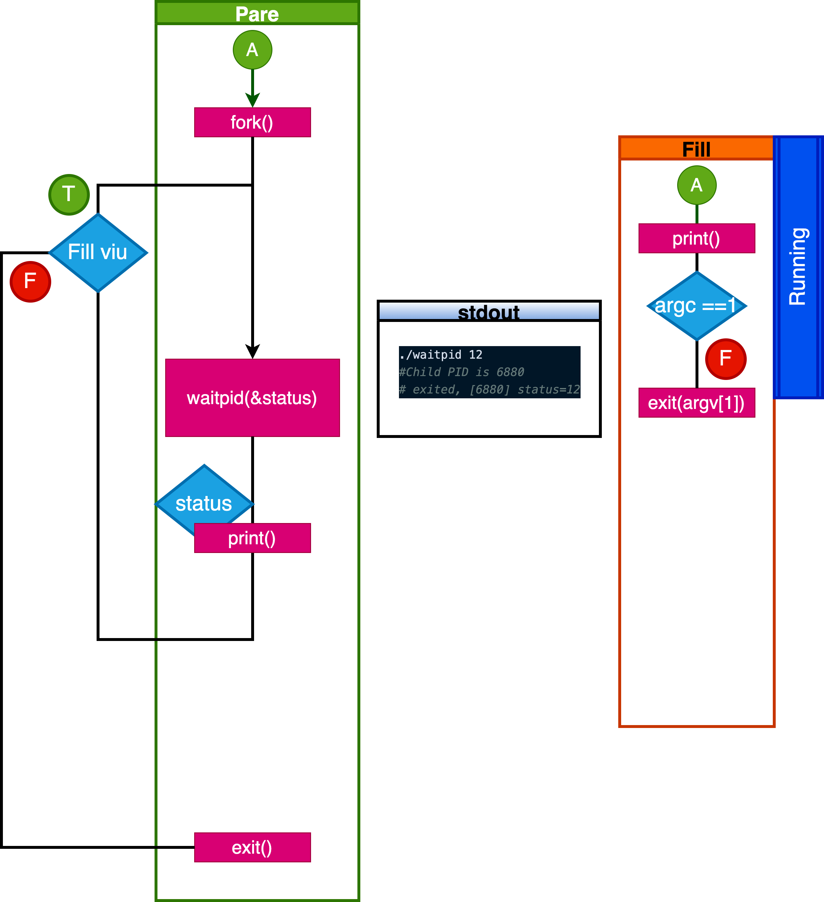{width="90%"}

:::
:::

Recobriment de processos
------------------------

::: columns
::: {.column width="45%"}

### ```EXEC```
La família de funcions *EXEC* ens serveixen per substituir el procés actual en execució per un procés nou.

::: example-box
No es crea cap procés \blueArrow Destrueix el procés actual [**A (fill)**]{.alert}. Primer fem servir **fork()** per crear un procés [**A (fill)**]{.alert} i, a continuació, utilitzem **exec()** per executar un programa nou dins del  [**B (fill)**]{.alert}.
:::

:::
::: {.column width="45%"}

{width="90%"}

:::
:::

Recobriment de processos
------------------------

```c
#include <unistd.h> 
int execl (const char * path, const char * arg, ...);
int execlp (const char * file, const char * arg, ...);
int execle (const char * path, const char * arg, ..., char * const envp []);
int execv (const char * path, char * const argv []);
int execvp (const char * file, char * const argv []);
int execve (const char * file, char * const argv [], char * const envp []);
```

###
> * Només retornarà [**-1**]{.alert} en el cas d’error.
> * *path* : Ruta del programa a executar.
> * *arg*: Arguments del programa a executar (el primer argument sempre és el programa a executar, i acaba la llista de paràmetres amb NULL).


Recobriment de processos
------------------------

### Trucs

> * Els tres primers accepten un nombre variable d'arguments. Per utilitzar aquesta característica, heu de carregar el fitxer de capçalera ```<stdarg.h>```.

> * Els tres últims són de la forma *execv*, en aquest cas els arguments es passen mitjançant una matriu de punters a cadenes on l'última entrada és **NULL**. Per exemple, és possible que en tingueu ```char * argv [] = {"Hola", "món!", NULL};```

> * Si el nom acaba en **l o v**, el nom del programa s'ha d'indicar completament. 

> * Si el nom conté una **p**, cercarà el fitxer utilitzant la variable d'entorn actual *PATH*.

> * Finalment, si el nom s'afegeix amb una **e**, es pot incloure una matriu de cadenes que indiquen variables d'entorn, cadascuna de les formes *ENVVAR = valor*. 

Exemple recobrint processos
---------------------------

::: columns
::: {.column width="50%"}

### Sense PATH
```{.c size="tiny"}
int main(int argc, char *argv[])
{
    pid_t pid, w;
    int status;

   pid = fork();
    if (pid == -1) {
        perror("fork");
        exit(EXIT_FAILURE);
    }

   if (pid == 0) {            /* Code executed by child */
        printf("(Before exec) - Child PID is %d\n", getpid());
        execl( "/usr/bin/ls", "ls", "-la", NULL);
        printf("(After exec) - Child PID is %d\n", getpid());
   } else {                    /* Code executed by parent */
        w = waitpid(pid, &status, WUNTRACED | WCONTINUED);
         if (WIFEXITED(status)) {
            printf("exited, [%d] status=%d\n", 
               pid, WEXITSTATUS(status));
        }
        exit(EXIT_SUCCESS);
    }
}
```

:::
::: {.column width="40%"}

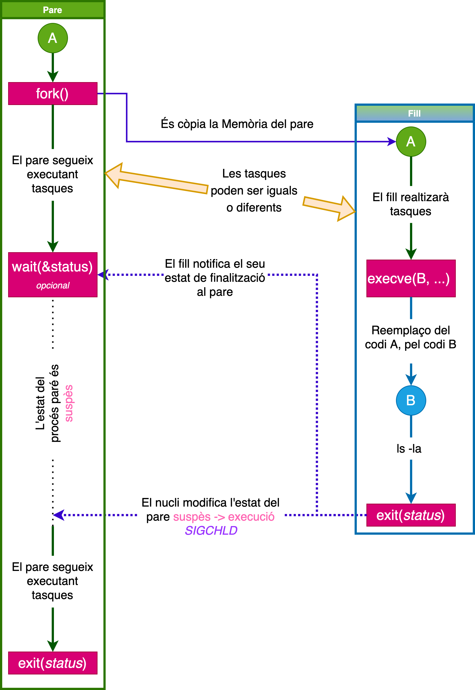{width="90%"}

:::
:::

Exemple recobrint processos
---------------------------

::: columns
::: {.column width="50%"}

### Utilitzant PATH
```{.c size="tiny"}
int main(int argc, char *argv[])
{
    pid_t pid, w;
    int status;

   pid = fork();
    if (pid == -1) {
        perror("fork");
        exit(EXIT_FAILURE);
    }

   if (pid == 0) {            /* Code executed by child */
        printf("(Before exec) - Child PID is %d\n", getpid());
        execlp( "ls", "ls", "-la", NULL);
        //execl( "ls", "ls", "-la", NULL);
        printf("(After exec) - Child PID is %d\n", getpid());
   } else {                    /* Code executed by parent */
        w = waitpid(pid, &status, WUNTRACED | WCONTINUED);
         if (WIFEXITED(status)) {
            printf("exited, [%d] status=%d\n", 
               pid, WEXITSTATUS(status));
        }
        exit(EXIT_SUCCESS);
    }
}
```

:::
::: {.column width="40%"}

{width="90%"}

:::
:::


Zombies (Walking dead... + o -)
--------------------------------

Quan un procés mor, l’estat del procés s’estableix en **EXIT_ZOMBIE** i es notifica al pare amb un senyal *SIGCHLD* que ha mort un dels seus fills. El procés zombi romandrà a la memòria fins que el pare reaccioni amb un **wait()/waitpid()**. Normalment, això passa immediatament, de manera que el kernel sap que tot està bé, que el pare ha obtingut tota la informació que necessita i el procés es pot netejar. Aquest procés es configura a *EXIT_DEAD* i es neteja. Si no s’invoca un **wait()/waitpid()**. En aquest cas, el procés zombi quedarà en la memòria per sempre.


::: example-box
Podeu comprobar els processos zombies amb la següent ordre: 
```sh
ps axo user,pid,ppid,command,s | grep -w Z
```
:::

Zombies (Walking dead... + o -)
--------------------------------

### Curiositats

> * Els morts vivents son notòriament difícils de matar, la principal raó és perquè ells ja estan morts. Per matar un *zombi*, llavors, necessitaràs acabar amb la cosa que els manté vius. 

> * En linux tenim 2 maneres. La primera és enviar un senyal *SIGCHLD* manualment al **pare**, no sempre funciona perquè el **pare** pot ignora el senyal. 

> * Una altra manera és fer el zombi orfe. Els processos *orfes* són processos que ja no tenen **pares**. Aquests processos s’assignen a **init**, que es converteix en el seu nou **pare**. **init** invoca regularment les trucades *wait()* i neteja tots els processos **orfes**. Així, quan mates el procés **pare**, mates indirectament tots els **zombis**.


Exemple: Factoria de zombies
----------------------------

::: columns
::: {.column width="50%"}

```c
int main() {
pid_t pid;
int i;
for (i = 0; ; i++) {
    pid = fork();
    if (pid > 0) {
        printf("Zombie #%d born:\n",
         i + 1);
        sleep(1);
    } else {
        printf("*drool* Boooo! 
           Arrgghh! *slobber*\n");
        exit(0);
    }
}
return 0;
}
```

:::
::: {.column width="40%"}

```sh
# Terminal 1
$ gcc zombie.c -o ./zombie
$ ./zombie
# Terminal 2
$ watch -n 1 "ps u -C zombie"
```

:::
:::

## Això és tot per avui

::: center
[**PREGUNTES?**]{.alert}

:::

::: columns
::: {.column width="50%"}

### Materials del curs

* **Organització**   --- [OS-GEI-IGUALADA-2425](https://github.com/OS-GEI-IGUALADA-2425)
* **Materials**    --- [Materials del curs](https://github.com/OS-GEI-IGUALADA-2425/materials)
* **Laboratoris**  --- [Laboratoris](https://github.com/OS-GEI-IGUALADA-2425/laboratoris)
* **Recursos**    --- [Campus Virtual](https://cv.udl.cat/)

[**TAKE HOME MESSAGE**]{.alert}: Les funcions **fork(), wait(), waitpid() i exec()** són fonamentals per a la gestió de processos en Unix/Linux, permetent la creació, espera i execució de nous programes, així com la sincronització i gestió eficient dels processos existents.

:::
::: {.column width="45%"}

:::center
{width=40mm}
:::

:::
:::
