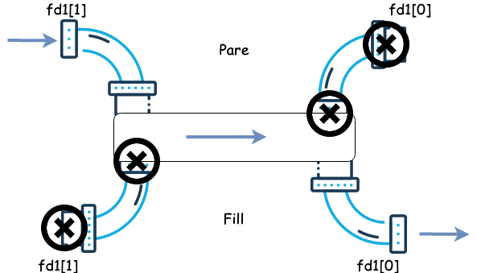
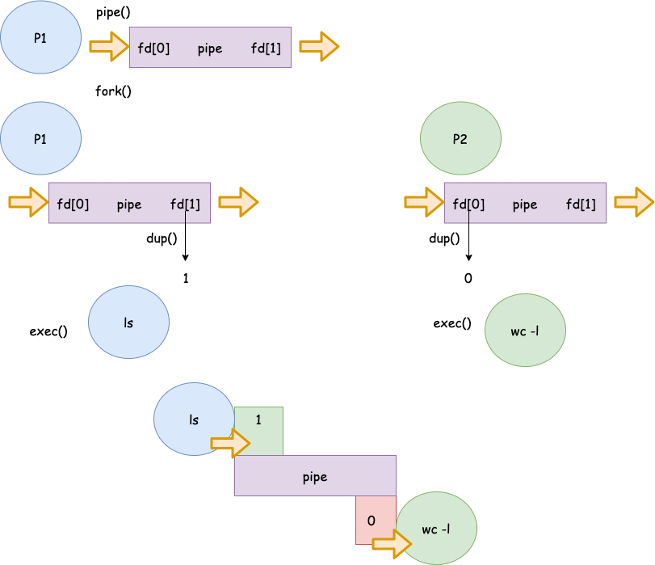

Pipes
===================

Implementació de les Pipes
---------------------------

Les pipes es poden implementar com a buffers circulars basats en memòria assignada pel sistema operatiu. Aquestes pipes es coneixen com a pipes sense nom i són transitòries. Una pipe *sense nom* deixa d'existir quan tots els processos que la tenen assiganda  **acaben** o **tanquen** els seus descriptors associats a la pipe.

{width="50%"}

Els pipes es creen en el moment que s'obren mitjançant la crida a sistema ```pipe()``` *(unistd.h)* o amb la sintaxis ```|```.


Creació de Pipes
-----------------


### Sintaxi
```c
int pipe(int desc[2]);                                                                                                
RETORNA:  0 on success                                                       
         -1 on error:    errno = EMFILE (no free descriptors)                  
                                 EMFILE (system file table is full)            
                                 EFAULT (fd array is not valid)                
```
> * La crida a sistema ```pipe()```, crea dos descriptors de fitxer. Un de *lectura* **(desc[0])** i un d'*escriptura* **(desc[1])**.
> * La informació que s'escriu per **desc[1]** es llegeix per **desc[0]**.
> * Una vegada el ```pipe()``` s'ha creat; per poder utilitzar-lo els processos han d'heretar aquests descriptors del procés pare.


Comunicació unidireccional (I)
--------------------------

{width="65%"}


Comunicació unidireccional (II)
--------------------------

{width="65%"}


Comunicació unidireccional (III)
--------------------------

{width="65%"}

Comunicació unidireccional (Esquema)
------------------------------------

```c
void main(){
   int fd[2]; // Descriptors associats a una pipe  
   pid_t   pidFill;
    /* El primer element de la matriu (fd[0]) està configurat i obert per 
    a la lectura, mentre que el segon element està configurat i obert per 
    escriure (fd[1]. Totes les dades que viatgen per la pipe es mouen 
    pel nucli. */
    pipe(fd); pidFill = fork();
     if (pidFill == -1){
        perror("fork"); exit(1);
     } else if (pidFill == 0){
         /*El procés fill tanca la escriptura per la pipe*/ close(fd[1]);
     } else {
         /* El procés pare tanca la lectura per la pipe */ close(fd[0]);
     }
 }
```

Comunicació bidireccional
--------------------------

> * El **procés pare** necessitarà dues pipes (una per cada direcció).
> * El **pare** fa un ```fork()``` creant una còpia del pare i duplicant els descriptors de fitxers associats a les dues **pipes**.
> * El procés **pare** *tanca la lectura de la sortida del pipe1*.
> * El procés **fill** *tanca l’escriptura a l’entrada del pipe1*.
> * El procés **fill** *tanca la lectura de la sortida del pipe2*.
> * El procés **pare** *tanca l’escriptura a l’entrada del pipe2*.

Comunicació bidireccional (Pipes)
--------------------------

::: columns
::: {.column width="45%"}
### Pipe 1



:::
::: {.column width="45%"}
### Pipe2


:::
:::


Escriptura en les pipes
-----------------------

> * L'escriptura a les *pipes* es realitza utilitzant la crida a sistema: **write()** o la funció **fprintf()**.
> * Si un procés **escriu** en un *pipe* que tingui el **descriptor de lectura tancat**, **[write() falla i s'envia un senyal SIGPIPE]{.alert}**.
> * Si un procés escriu *menys bytes* dels que admet el *pipe*, **l'escriptura es realitza de forma atòmica**.
> * Si s'intenta escriure sobre un *pipe* **ple**; **el procés** es queda *bloquejat* fins que el *pipe es buidi* **(un altre procés ha llegit les dades)** i *llavors s'acaba l'escriptura*.

Lectura de les pipes
-------------------

> * La lectura dels *pipes* es fan mitjançant la crida a sistema: **read()** o la funció **fscanf()**.
> * Si un procés **llegeix** en un *pipe* que tingui el **descriptor tancat**, **[retorna un 0, indicant la condició de final de fitxer]{.alert}**.
> * Si un procés **llegeix** d’un **pipe** *buit es bloqueja fins que les dades estiguin disponibles*.
> * Si un procés intenta **llegir** *més dades que les disponibles* en un pipe, *es llegeixen els disponibles i es retorna el nombre de bytes llegits*.

Exemple: Lector-Escriptor (I)
--------------------------

::: columns
::: {.column width="50%"}

### Lector
```c
int main() {
    int fd[2];
    pid_t p1 = fork();

    if (p1 > 0) {
    {
      close(fd[1]);  
      char buf[100];
      read(fd[0], buf, sizeof(buf));
      printf("MSG: %s\n",buf);
      close(fd[0]);  
    }
```

:::
::: {.column width="50%"}

### Escriptor
```c
else if (p1 == 0) {
    close(fd[0]);  
    char msg[5];
    sprintf(msg, "msg1");
    write(fd[1], msg, strlen(msg));
    close(fd[1]);  
    exit(0);
  }
}
```
:::
:::

Exemple: Lector-Escriptor (II)
-----------------------------

::: columns
::: {.column width="50%"}
### Pare
```c
int main() {
  int fd[2]; int r = pipe(fd);
  pid_t p1 = fork();
  if (p1 == 0) { /*Fill*/ }
  close(fd[1]);
  char buf[100];
  while(read(fd[0],&buf,sizeof(buf))){
    printf("I got a message! 
      It was %s\n", buf);
    }
  printf("No more messages :(\n");
  close(fd[0]);
}
```

:::
::: {.column width="50%"}
### Fill
```c
close(fd[0]);
char msg[5];
sprintf(msg,"msg1");
ssize_t nw = write(fd[1], 
    msg, strlen(msg));
sprintf(msg,"msg2");
nw = write(fd[1], 
    msg, strlen(msg));
close(fd[1]); 
while(1);
exit(0);
```

:::
:::

Exemple: Lector-Escriptor (III)
-----------------------------

::: columns
::: {.column width="50%"}
### Pare
```c
int main() {
  int fd[2]; int r = pipe(fd);
  pid_t p1 = fork();
  if (p1 == 0) { /*Fill*/ }
  close(fd[1]);
  char buf[100];
  while(read(fd[0],&buf,sizeof(buf))){
    printf("I got a message! 
      It was %s\n", buf);
    }
  printf("No more messages :(\n");
  close(fd[0]);
}
```

:::
::: {.column width="50%"}
### Fill
```c
close(fd[0]);
char msg[5];
sprintf(msg,"msg1");
ssize_t nw = write(fd[1], 
    msg, strlen(msg));
sprintf(msg,"msg2");
nw = write(fd[1], 
    msg, strlen(msg));
//close(fd[1]);  <-
while(1);
exit(0);
```
:::
:::

Exemple: Lector-Escriptor (IV)
-----------------------------

::: columns
::: {.column width="50%"}
### Pare
```c
void sigpipe_handler(int signum) {
    printf("SIGPIPE...\n");
    exit(EXIT_SUCCESS);
}
int main() {
  int fd[2]; int r = pipe(fd);
  pid_t p1 = fork();
  if (p1 == 0) { /*Fill*/ }
    close(fd[1]);  
    signal(SIGPIPE, sigpipe_handler);
    write(fd[1], "Hello", 5);
}
```

:::
::: {.column width="50%"}
### Fill
```c
close(fd[0]);  
sleep(2);  
close(fd[1]);  
exit(EXIT_SUCCESS);
```
:::
:::


Redirecció i duplicats
-----------------------

Per utilitzar *pipes* amb la crida a sistema *exec* i simular el comportament del sistema operatiu quan interactuem amb la *shell*, necessitem redireccionar la sortida i l'entrada de la pipe a *descriptors de fitxers* predefinits assignats a cada procés.


{width="55%"}

Redirecció i duplicats
-----------------------
### Passos

* Tancant els descriptors estàndard.
* Duplicant els descriptors de fitxer utilitzant la crida a sistema ```dup()```*(unistd.h)*.

```c
int dup(int fdold)
int dup2(int fdold, int fdnew)
```

* *dup*: utilitza el descriptor de fitxer lliure més petit per duplicar el descriptor de fitxer *fdold*.
* *dup2*: fa que *fdnew* sigui una còpia de *fdold*, tancant *fdold* si és necessari.


Exemple a linux:  *ls | wc -l*
-------------------------------

{width="80%"}

Exemple a linux:  *ls | wc -l*
-------------------------------

> - El *procés 1* farà un **recobriment de la comanda ls** i l'**executarà**. Per defecte la comanda *ls* imprimeix per *stdout* el llistat de fitxers i directoris del directori actual.
> - En aquest cas *la pipe (|)* indica que ```ls``` no escriurà per **stdout** i ho farà per la **pipe**. D'aquesta manera no veurem el llista de fitxers a la terminal, seran enviats a la *pipe*.
> - El *procés 2* farà un **recobriment de la comanda wc -l**, aquesta comanda *compta el nombre de línies rebudes per* **stdin**. En aquest cas, com tenim la comanda precedida d'una pipe...  El procés *redireccionarà* **stdin** a la **pipe**. Per tant, llegirà el contingut escrit per la comanda ```ls```. 
> - Per defecte la comanda ```wc -l``` escriu a **stdout**, com ara no hi ha cap més **pipe**. Aquesta sortida **[no es redirecciona]{.alert}** i per tant únicament veurem el resultat per **stdout**. És a dir, el nombre de fitxers i directoris del directori actual.

Exemple a linux:  *ls | wc -l*
-------------------------------

{width="60%"}

Implementació amb C - *ls | wc -l* (I)
-------------------

```c
int main(int argc, char *argv[]){
int fd[2];
char *p1[] = {"ls", NULL};
char *p2[] = {"wc", "-l", NULL};
if (pipe(fd)<0){ perror("Error de creació del pipe fd[]");exit(-1);}

int pid1;int pid2;
switch (pid1 = fork()){
    case -1: perror("Error fork()"); exit(-2); break;
    case 0: //@TODO
}
switch (pid2 = fork()){
    case -1: perror("Error fork()"); exit(-2); break;
    case 0: //@TODO
}
waitpid(pid1,0,0); 
waitpid(pid2,0,0);
}
```

Implementació amb C - *ls | wc -l* (II)
-------------------
### Fill 1 (ls)
```c
if (close(pfd[0]) == -1)                    
    perror("close 1");

    /* Duplicate stdout on write end of pipe; 
    close duplicated descriptor */

    if (fd[1] != STDOUT_FILENO) {              
        if (dup2(fd[1], STDOUT_FILENO) == -1)
            perror("dup2 1");
        if (close(fd[1]) == -1)
            perror("close 2");
    }

    execlp("ls", "ls", (char *) NULL);          
    perror("execlp ls");
```

Implementació amb C - *ls | wc -l* (I)
-------------------
### Fill 2 (wc -l)
```c
   if (close(fd[1]) == -1)                    
        perror("close 3");

    /* Duplicate stdin on read end of pipe; 
    close duplicated descriptor */

    if (fd[0] != STDIN_FILENO) {              
        if (dup2(fd[0], STDIN_FILENO) == -1)
            perror("dup2 2");
        if (close(fd[0]) == -1)
            perror("close 4");
    }

    execlp("wc", "wc", "-l", (char *) NULL);
    perror("execlp wc");
```

Implementació amb C - *ls | wc -l* (III)
-------------------

::: center
Com és que el programa no acaba mai? 
:::

El procés pare ha de tancar els descriptors de fitxer que no utilitza. Si no els procés fill lector de la pipe no acaba mai. Ja que no tots els processos han tancat els descriptors de fitxer associats a la **pipe**.

```c
// Pare
if (close(fd[0]) == -1)
    perror("close");
if (close(fd[1]) == -1)
    perror("close");

waitpid(pid1,0,0);
waitpid(pid2,0,0);
```

## Això és tot per avui

::: center
[**PREGUNTES?**]{.alert}

:::

::: columns
::: {.column width="50%"}

### Materials del curs

* **Organització**   --- [OS-GEI-IGUALADA-2425](https://github.com/OS-GEI-IGUALADA-2425)
* **Materials**    --- [Materials del curs](https://github.com/OS-GEI-IGUALADA-2425/materials)
* **Laboratoris**  --- [Laboratoris](https://github.com/OS-GEI-IGUALADA-2425/laboratoris)
* **Recursos**    --- [Campus Virtual](https://cv.udl.cat/)

[**TAKE HOME MESSAGE**]{.alert}: Les pipes són mecanismes de comunicació entre processos que permeten la transmissió de dades d'un procés a un altre. Es poden utilitzar per a comunicació unidireccional o bidireccional. Cal comprendre com crear pipes, escriure i llegir dades en elles, i com utilitzar-les en la redirecció d'entrada/sortida de processos en execució.

:::
::: {.column width="45%"}

:::center
{width=40mm}
:::

:::
:::
