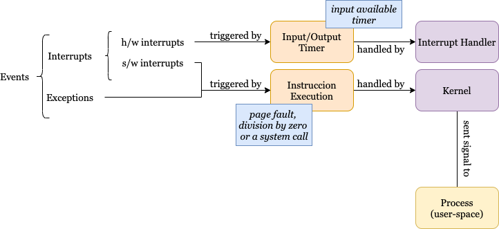
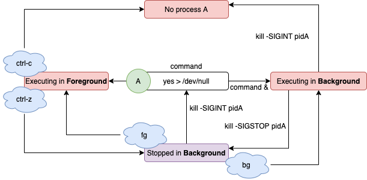
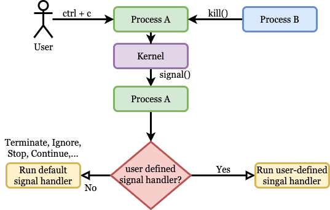

# Senyals

## Context

::: columns
::: {.column width="40%"}

```c
// A
int x = 0;
int y = 5 / x;
```

Un senyal és una eina de notificació. Ens permet avisar un procés que es produeix algun esdeveniment i fer alguna acció. En l'exemple *l'esdeveniment és l'excepció* i **l'acció és acabar el procés.**

:::
::: {.column width="50%"}

> * El procés A s'està executant a la nostra CPU.
> * El procés A provoca un error de divisió per zero. 
> * La CPU notificarà al nucli que el procés A causa un error (Excepció)
> * El nucli enviarà al procés el senyal SIGFPE.  Senyal
> * El procés A es finalitzat degut al Gestor de senyals

:::
:::

Esdeveniments
-------------

::: center
Hi ha dos tipus d'esdeveniments, **interrupcions i excepcions**.  
:::

### Interrupcions Hardware
Són activades per dispositiu d'entrada/sortida o pel temporitzador (per exemple quan tenim una entrada disponible) i gestionades pel gestor d'interrupcions com ja vau veure a primer curs.  

### Interrupcions Software
En canvi, les excepcions i les interrupcions software són activades per l'execució d'alguna instrucció (divisió 0 o crida a sistema)  i aquestes són gestionades pel kernel que respondrà enviant un senyal a un procés de l'espai d'usuari. Com heu vist en el primer exemple. Més endavant veurem que fa el procés quan rep el senyal.

Esdeveniments
-------------




Exemple
--------

### Enunciat
Quants senyals estem enviant? Quines? Quina acció fa el procés quan rep els senyals?

```c
# yes > /dev/null
crtl+z
# bg
crtl+c
```

Exemple
-------

* *Quants senyals estem enviant?* 2
* *Quines?* SIGSTOP, SIGCONT
* *Quina acció fa el procés quan rep les senyals?* Aturar l'execució en primer pla i portar el procés a segon pla. Arrancar l'execució en segon pla.
 

La comanda *yes>/dev/null* crearà un **procés A** i s'executa al *primer pla*, quan un usuari pitjà el **ctrl-z**, el kernel automàticament envia un senyal *SIGSTOP* al **procés A,** que modifica el seu estat d'execució a parat i també marxa del primer pla al segon pla. 

Exemple
-------

Després amb la comanda **bg**, el kernel tramet al procés el senyal *SIGCONT* i continua la seva execució en segon pla quan la rep. Una altra manera equivalent per realitzar aquest procés és **yes>/dev/null &** on *&* ens envia l'ordre directament en execució al background.

Observeu també com de  forma similar la comanda **fg**; en aquest cas el kernel tramet *SIGCONT* i el procés quan rep *SIGCONT*; torna a executar-se al primer pla.  Noteu que amb ctrl-c tenim un comportament similar; i el procés en primer pla és acabat en rebre el senyal *SIGKILL* (**ctrl+c**).

Senyals, processos i shells
---------------------------



Reflexió
---------

### Enunciat

Quina diferència hi ha entre fer un **ctrl+c** i la situació de l'exemple 1. En els dos casos es genera un senyal i és tractada pel kernel?


Reflexió
---------

### Enunciat

Quina diferència hi ha entre fer un **ctrl+c** i la situació de l'exemple 1. En els dos casos es genera un senyal i és tractada pel kernel?

### Solució

La principal diferència és en el primer exemple l'esdeveniment és síncron amb l'execució del procés mentre en el segon **ctrl+c** és asíncron.


Recapitulant
------------

::: columns
::: {.column width="45%"}
Els esdeveniments que acaben generant senyals es poden generar per *comandes de l'usuari*, *per procés extern* o pel *mateix procés*, però sempre és el **kernel qui gestiona l'esdeveniment enviant el senyal corresponent al procés A**, quan el procés A rep el senyal es pregunta *si té alguna acció definida*, si la té l'executa, i si no executa una *acció per defecte*, que quasi sempre és acabar el procés, però també pot ser *parar, continuar o ignorar*.
:::
::: {.column width="45%"}

:::
:::


Els senyals **SIGKILL** i **SIGSTOP** no poden ser capturats i per tant no podreu modificar el comportament per defecte per raons òbvies de seguretat.

Activitat
---------

Quin problema podria tenir un procés que executa el codi següent, si rebem un SIGINT. Com podem solucionar-ho?

```c
int main(void) {
   FILE *psFile;
   psFile = fopen("temp.txt", "w");
   ...
   fclose(psFile);
   remove("temp.txt");
   return 0;
}
```

Enviament de senyals (I)
---------------------

```c
#include <signal.h> 
int kill(pid_t pid, int sig);
```

Envia el senyal *sig* al/s procés/ssos segons pid:

* **pid > 0** : S'envia al procés receptor.
* **pid = 0** : S'envia als processos del mateix grup que l'emissor.
* **pid = -1** : S'envia a tots els processos als quals el procés té permís per enviar senyals.
* **pid < -1** : S'envia a tots els processos l'id del grup que coincideixi amb el valor absolut de pid.


Enviament de senyals (II)
---------------------

```c
#include <signal.h> 
int kill(pid_t pid, int sig);
```

Valors de retorn:

* En cas d'èxit, s'ha enviat com a mínim un senyal, es retorna **zero**.
* En cas d'error, retorna **SIG_ERR**

Rutines de Tractament de senyals
------------------

```c
#include <signal.h> 
typedef void (*sighandler_t)(int);
sighandler_t signal(int signum, sighandler_t manejador);
```

Quan el procés rebi el senyal *signum* executarà *manejador*, que
pot ser una **funció** o **SIG_DFL**, acció per defecte, o **SIG_IGN** per ignorar el senyal.

### Valors de retorn
* En cas d'èxit retorna un **punter a la anterior funció gestora del senyal**.
* En cas d'error, retorna **SIG_ERR**.

Espera recepció senyals
------------------------

```c
#include <unistd.h> 
int pause(void);
```

* Sempré **retorna -1**.
* Es **bloqueja** fins que el procés rep un senyal (qualsevol).

Bloqueig temporal
------------------------

```c
#include <unistd.h> C
unsigned int alarm(unsigned int sec);
```

El procés s'envia a si mateix després de *sec* segons un senyal **SIGALRM**. Retorna el nombre de segons pendents si hi havia una crida a *alarm* anterior, o zero en altre cas.

Taula de senyals
-------------------

| Senyal | ID | Descripció | Defecte |
|---------|----|-----------------------------------------|--------------------------|
| SIGABRT | 6 | Process Abort | Impl. dependent |
| SIGALRM | 14 | Alarm clock | Ab. termination |
| SIGCONT | 25 | Continue if stopped | Continue |
| SIGFPE | 8 | Arithmetic error | Impl. dependent |
| SIGKILL | 9 | Terminate. Cannot be caught or ignored. | Ab. termination. |
| SIGINT | 2 | Interactive attention signal (Ctrl + C) | Implementation dependent |
| SIGUSR1 | 16 | User-defined signal 1 | Ab. termination. |
| SIGUSR2 | 17 | User-defined signal 2 | Ab. termination. |

## Això és tot per avui

::: center
[**PREGUNTES?**]{.alert}

:::

::: columns
::: {.column width="50%"}

### Materials del curs

* **Organització**   --- [OS-GEI-IGUALADA-2425](https://github.com/OS-GEI-IGUALADA-2425)
* **Materials**    --- [Materials del curs](https://github.com/OS-GEI-IGUALADA-2425/materials)
* **Laboratoris**  --- [Laboratoris](https://github.com/OS-GEI-IGUALADA-2425/laboratoris)
* **Recursos**    --- [Campus Virtual](https://cv.udl.cat/)

[**TAKE HOME MESSAGE**]{.alert}: La comprensió de com els senyals i els sistemes operatius interaccionen és crucial per a una sincronització eficient dels esdeveniments i per gestionar les respostes dels processos. 

:::
::: {.column width="45%"}

:::center
{width=40mm}
:::

:::
:::
