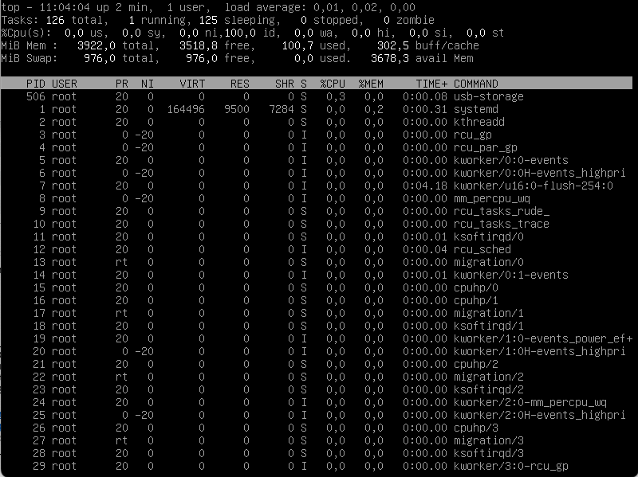
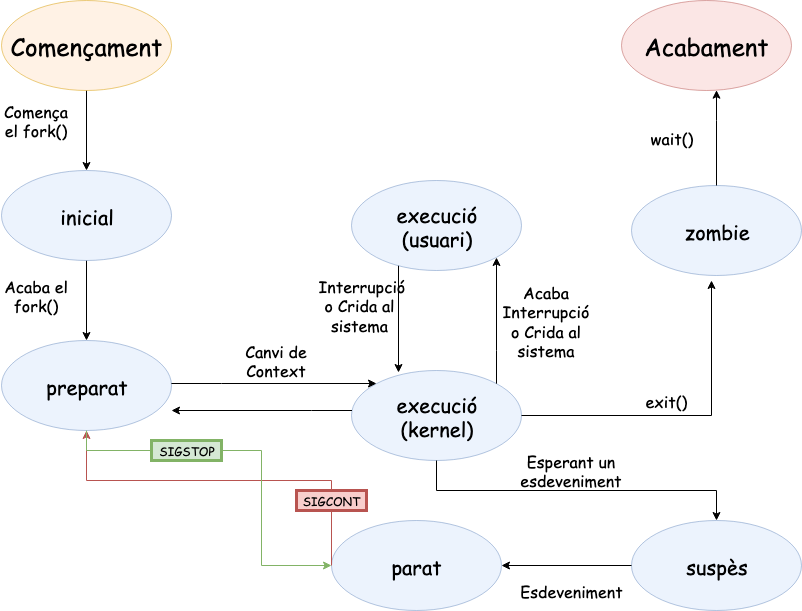
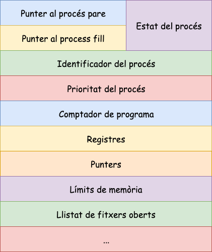
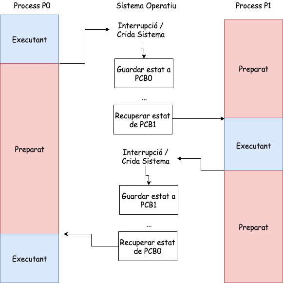
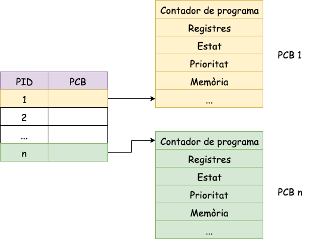

Processos en Unix/Linux
=========================================

Concepte
-------------

Un **procés** és una instancia d’un programa en execució [(tasca)]{.alert}.  Això vol dir que si **10 usuaris d’un servidor** utilitzen el mateix programa, com ```vi```, hi ha **10 processos** *vi* que s’executen al servidor, tot i que *tots comparteixen el mateix codi executable*.

> * Creació i eliminació.
> * Garantir l'execució i finalització.
> * Controlar errors i excepcions.
> * Assignació de recursos.
> * Comunicació i sincronització.

Comanda *ps* (I)
--------------

::: center
Heu de crear primer 3 processos en una terminal executant 3 vegades ( ```sleep 120 &```). Aquesta ordre crearà un procés *sleep* que estarà *120s* en *background* gràcies a l'operador **(&)**.
:::

::: columns
::: {.column width="45%"}

### Comentaris sobre la comanda: `ps -e`

L'opció **-e** indica a l'ordre que mostri **tots els processos del sistema**. Sense aquesta opció, l'ordre només mostra els processos de l'usuari a la sessió actual.

Aquests processos tenen PID *1053, 1054 i 1054*. [*També observeu l'ordre ps al final de la llista. Això es deu al fet que l'ordre en si també és un procés.*]{.alert}

:::
::: {.column width="45%"}

```{.sh size="tiny"}
ps -e
    PID TTY          TIME CMD
      1 ?        00:00:01 systemd
      2 ?        00:00:00 kthreadd
      3 ?        00:00:00 rcu_gp
      4 ?        00:00:00 rcu_par_gp
      6 ?        00:00:00 kworker/0:0H-events_highpri
      9 ?        00:00:00 mm_percpu_wq
     10 ?        00:00:00 rcu_tasks_rude_
     11 ?        00:00:00 rcu_tasks_trace
     12 ?        00:00:00 ksoftirqd/0
     13 ?        00:00:03 rcu_sched
     14 ?        00:00:00 migration/0
     15 ?        00:00:00 cpuhp/0
     17 ?        00:00:00 kdevtmpfs
     18 ?        00:00:00 netns
     ...
   1053 pts/0    00:00:00 sleep
   1054 pts/0    00:00:00 sleep
   1055 pts/0    00:00:00 sleep
   1056 pts/0    00:00:00 ps
```

:::
:::

Comanda *ps* (II)
--------------

::: columns
::: {.column width="45%"}

### Descripció dels camps de la comanda `ps -e`

> * La columna *CMD* identifica el nom del procés en execució, com ara *sleep*.
> La primera columna indica l’identificador de procés (**PID**) assignat al procés pel sistema operatiu.
> * La segona columna mostra el terminal associat a un procés o *?* si el procés no s’associa a cap terminal.
> * Finalment, la tercera columna mostra el *temps de la CPU* del procés.

:::
::: {.column width="45%"}

```{.sh size="tiny"}
ps -e
    PID TTY          TIME CMD
      1 ?        00:00:01 systemd
      2 ?        00:00:00 kthreadd
      3 ?        00:00:00 rcu_gp
      4 ?        00:00:00 rcu_par_gp
      6 ?        00:00:00 kworker/0:0H-events_highpri
      9 ?        00:00:00 mm_percpu_wq
     10 ?        00:00:00 rcu_tasks_rude_
     11 ?        00:00:00 rcu_tasks_trace
     12 ?        00:00:00 ksoftirqd/0
     13 ?        00:00:03 rcu_sched
     14 ?        00:00:00 migration/0
     15 ?        00:00:00 cpuhp/0
     17 ?        00:00:00 kdevtmpfs
     18 ?        00:00:00 netns
     ...
   1053 pts/0    00:00:00 sleep
   1054 pts/0    00:00:00 sleep
   1055 pts/0    00:00:00 sleep
   1056 pts/0    00:00:00 ps
```

:::
:::

Comanda *ps* (III)
--------------

::: columns
::: {.column width="45%"}

> * L'identificador de procés (**PID**) és un identificador únic per a un procés.
> * El sistema operatiu utilitza un comptador de 32 bits *last_pid* per fer un seguiment de l’últim PID assignat a un procés.
> * Quan es crea un procés, el comptador augmenta i el seu valor es converteix en el **PID** del nou procés.
> * El kernel ha de comprovar si el valor de *last_pid* ++ ja pertany a una tasca, abans que pugui assignar-lo a un procés nou.

:::
::: {.column width="45%"}

```{.sh size="tiny"}
ps -e
    PID TTY          TIME CMD
      1 ?        00:00:01 systemd
      2 ?        00:00:00 kthreadd
      3 ?        00:00:00 rcu_gp
      4 ?        00:00:00 rcu_par_gp
      6 ?        00:00:00 kworker/0:0H-events_highpri
      9 ?        00:00:00 mm_percpu_wq
     10 ?        00:00:00 rcu_tasks_rude_
     11 ?        00:00:00 rcu_tasks_trace
     12 ?        00:00:00 ksoftirqd/0
     13 ?        00:00:03 rcu_sched
     14 ?        00:00:00 migration/0
     15 ?        00:00:00 cpuhp/0
     17 ?        00:00:00 kdevtmpfs
     18 ?        00:00:00 netns
     ...
   1053 pts/0    00:00:00 sleep
   1054 pts/0    00:00:00 sleep
   1055 pts/0    00:00:00 sleep
   1056 pts/0    00:00:00 ps
```

:::
:::

Comanda *top*
--------------

::: columns
::: {.column width="30%"}

Una altra ordre útil és ```top```. Aquesta ordre proporciona una visió contínua de l'activitat del processador en temps real. Mostra un llistat de les tasques més intenses en CPU del sistema i pot proporcionar una interfície interactiva per manipular processos.

:::
::: {.column width="60%"}



:::
:::

Estat dels processos
---------------------

::: columns
::: {.column width="35%"}

### Descripció dels estats dels processos

> * **Nou**: Procés que encara no està creat del tot, li falta el *PCB*.
> * **Inactiu**: Quan un procés ha finalitzat.
> * **Preparat**: Quan un procés té assignats tots els recursos necessaris per poder executar-se (excepte la CPU).
> * **Execució**: Quan un procés té assignada la CPU.
> * **Espera**: Quan al procés li falta algun recurs per poder executar-se.

:::
::: {.column width="55%"}

Per veure informació dels processos en UNIX tornarem a fer servir la comanda *ps*. Si fem ```man ps``` i busquem PROCESS STATE CODES, veurem el següents estats:

> * **D**   uninterruptible sleep (usually IO)
> * **I**     Idle kernel thread
> * **R**     running or runnable (on run queue)
> * **S**     interruptible sleep (waiting for an event to complete)
> * **T**     stopped by job control signal
> * **t**     stopped by debugger during the tracing
> * **W**     paging (not valid since the 2.6.xx kernel)
> * **X**     dead (should never be seen)
> * **Z**    defunct ("zombie") process, terminated but not reaped by its parent

:::
:::

Comanda *ps* (IV)
-------------------------------

Es pot mostrar més informació sobre la llista de processos mitjançant l’opció **-l** de l’ordre ps:

```sh
ps -l
F S   UID     PID    PPID  C PRI  NI ADDR SZ WCHAN  TTY          TIME CMD
4 S     0    1034    1007  0  80   0 -  2095 -      pts/0    00:00:00 bash
0 T     0    1059    1034  0  80   0 -  3448 -      pts/0    00:00:00 vi
0 S     0    1064    1034  0  80   0 -  1326 -      pts/0    00:00:00 sleep
4 R     0    1065    1034  0  80   0 -  2405 -      pts/0    00:00:00 ps
```

La primera columna (**F**) de la sortida anterior identifica els indicadors de procés (vegeu la pàgina del manual si esteu interessats). La columna (**S**) indica l'estat d'un procés.

Recordeu que sense l'opció **-e**, ```ps``` només mostra els processos al terminal actual, en aquest cas **pts/0**.

Observacions
-------------

### Observació 1

Notareu que la majoria dels processos del sistema són inactius, que esperen algun tipus d’esdeveniment, com ara fer clic amb el ratolí o prémer una tecla. A l'exemple anterior, l'única ordre en execució és ```ps```.

### Observació 2

A la sortida també es mostra l’usuari propietari del procés (**UID**), l’identificador de procés (**PID**) i el PID pare (**PPID**). El **PPID** identifica el procés a partir del qual es va originar un procés determinat. Per exemple, podeu veurea l'exemple anterior que tant *vi ,sleep i ps* s'han originat en el mateix procés *shell bash (PID = 1034)*, perquè els seus **PPID** són iguals al PID de bash. D’altra banda, un procés que s’origina a partir d’un altre procés s’anomena procés fill.

Comanda pstree
--------------

::: columns
::: {.column width="50%"}

Podeu veure 2 connexions **ssh** utilitzant el dimoni *sshd*.  Si analitzem *sshd* es pot observar com s'inicia al **procés bash** i d'aquest procés neixen diferents fills, compareu amb la sortida de **ps -l** .

```{.sh size="tiny"}
ps -l
F S   UID     PID    PPID  C PRI  NI ADDR SZ WCHAN  TTY      CMD
4 S     0    1034    1007  0  80   0 -  2095 -      pts/0    bash
0 T     0    1059    1034  0  80   0 -  3448 -      pts/0    vi
0 T     0    1066    1034  0  80   0 -  3448 -      pts/0    vim
0 T     0    1068    1034  0  80   0 -  2358 -      pts/0    top
0 T     0    3502    1034  0  80   0 - 30692 -      pts/0    emacs
0 T     0    3505    1034  0  80   0 - 30692 -      pts/0    emacs
4 R     0    3569    1034  0  80   0 -  2405 -      pts/0    ps
```

```sh
su root -c "apt-get install psmisc -y"
```

:::
::: {.column width="50%"}

Gràcies al camp **PPID**, la llista de processos també es pot veure com un arbre, a la part superior del qual hi ha el pare de tots els processos: el procés d'inici [(PID = 1)]{.alert}.

```{.sh size="tiny"}
pstree
systemd-|-agetty
        |--cron
        |--dbus-daemon
        |--dhclient---3*[{dhclient}]
        |--exim4
        |--rsyslogd---3*[{rsyslogd}]
        |--sshd-|-sshd---bash-|-2*[emacs---{emacs}]
        |       |             |--pstree
        |       |             |--top
        |       |             |--vi
        |       |             |--vim
        |       |--sshd---bash---emacs---{emacs}
        |--systemd---(sd-pam)
        |--systemd-journal
        |--systemd-logind
        |--systemd-timesyn---{systemd-timesyn}
        |--systemd-udevd
        |--wpa_supplicant
```

:::
:::

Diagrama de transició d'estats (I)
------------------------------

El temps de vida d'un procés X pot ser conceptualment dividit en un conjunt d'estats que descriuen el comportament de l'procés.

> * Executant-se en mode usuari.
> * Executant-se en mode nucli o supervisor.
> * Preparat en memòria principal per a ser executat. El procés no està executant, però està carregat en memòria principal punt per ser executat tan aviat ho planifiqui el kernel.
> * Dormit o bloquejat en memòria principal. El procés es troba esperant en memòria principal a què es produeixi un determinat esdeveniment, com per exemple, la finalització d'una operació d'E/S.

Diagrama de transició d'estats (II)
------------------------------

> * **Preparat en memòria secundària per a ser executat**. El procés ja es podrà executat però es troba en memòria secundària.
> * **Dormit o bloquejat en memòria secundària**. El procés està esperant en memòria secundària a què es produeixi un determinat esdeveniment.
> * **Expropiat**. Quan un procés (A) executant-se en mode usuari ha finalitzat el seu temps, arriba una interrupció del rellotge de sistema per avisar d'aquest fet. El tractament d'aquesta interrupció en mode kernel, fa que el procés A sigui expropiat de la CPU i que un altre procés B passi a ser planificat per ser executat. En essència, l'estat expropiat és el mateix que l'estat preparat en memòria principal per ser executat, però es descriuen separadament per emfatitzar que [**un procés expropiat té garantit que el seu pròxim estat serà execució en mode usuari quan torni a ser planificat per ser executat**]{.alert}.
> * **Creat**. El procés s'ha creat recentment i està en un estat de transició. El procés existeix, però no es troba preparat per ser executat ni tampoc està adormit. Aquest estat és l'inicial per a tots els processos excepte per al procés amb *pid = 0*.
> * **Zombi**. Aquest és l'estat final d'un procés a què s'arriba mitjançant l'execució explícitament o implícita de la crida a sistema *exit*.

Diagrama de transició d'estats (III)
---------------------------------

::: center
{width="70%"}
:::

Diagrama de transició d'estats (IV)
-------------------------------

\onslide<1->

* **Creació d'un nou procés**

Quan un nou procés (A) es crea, mitjançant una crida a sistema *fork* realitzada per un altre procés (B), el primer estat en què entra A és l'estat creat. Des d'aquí pot passar, depenent de si hi ha prou espai en memòria principal \blueArrow preparat per a execució en memòria principal o preparat per a execució en memòria secundària.

\onslide<2->

* **Execució en Memòria princial**

Si el procés es troba en l'estat preparat per a execució en memòria principal llavors el planificador de processos pot escollir-lo per a ser executat, de manera que passarà a l'estat execució en mode supervisor. Quan el procés finalitzi l'execució de la seva part de la crida a sistema *fork* llavors passarà a l'estat execució en mode usuari, on començarà a executar-se les instruccions de la regió de codi de el procés.

Diagrama de transició d'estats (V)
-------------------------------

\onslide<1->

* **Planificador**
  
Quan el procés esgota el seu temps, el rellotge de sistema enviarà una interrupció al processador. El tractament es realitza en mode kernel \blueArrow el procés ha de passar de nou a l'estat executant-se en mode nucli. Quan el manipulador de la interrupció finalitza, el planificador expropiarà de la CPU al procés A i planificarà un altre procés C per a ser executat.  El procés A passa a l'estat expropiat. Quan el planificador torni a seleccionar el procés A per ser executat aquest tornarà a l'estat executant-se en mode usuari

\onslide<2->

* **Invocació de crides a sistema**
  
Si el procés A invoca durant la seva execució en mode usuari una crida a sistema, llavors passa a l'estat execució en mode nucli. Suposem que la crida a sistema necessita realitzar una operació d'E/S amb el disc, llavors el kernel ha d'esperar que es completi l'operació, \blueArrow el procés (A) passa a l'estat adormit en memòria principal. Quan es completa l'operació d'E/S, el maquinari interromp a la CPU i el manipulador de la interrupció despertarà el procés, la qual cosa provocarà que passi a l'estat preparat per a execució en memòria principal.

Diagrama de transició d'estats (VI)
-------------------------------

\onslide<1->

* **Execució en Memòria secundaria**
  
Suposem que en el sistema s'estan executant molts processos i que no hi ha prou espai en memòria. En aquesta situació l'intercanviador tria per ser intercanviats a memòria secundària a alguns processos (entre ells el procés A) que es troben en l'estat preparat per a execució en memòria principal o en l'estat expropiat. Aquests processos passaran a l'estat preparat per a execució en memòria secundària.


Diagrama de transició d'estats (VIII)
-------------------------------

\onslide<1->

* **Retorn a Memòria Principal**

En un moment donat, l'intercanviador tria el procés més apropiat per intercanviar a la memòria principal, suposem que es tracta del procés A. Aquest passa a l'estat preparat per a execució en memòria. A continuació, el planificador en algun instant triarà el procés per executar-se i llavors passarà a l'estat execució en mode supervisor on continuarà amb l'execució de la crida a sistema. Quan finalitzi la crida a sistema passarà de nou a l'estat execució en mode usuari.

\onslide<2->

* **Finalitzant el procés**

Quan el procés es completi, invocarà explícitament o implícitament a la crida a sistema exit, en conseqüència passarà a l'estat execució en mode supervisor. Quan es completi aquesta crida a sistema passarà finalment a l'estat zombi.

Consideracions (I)
---------------

\onslide<1->

Un procés té control sobre algunes transicions d'estat. En primer lloc, un procés pot crear un altre procés. No obstant això, [és el kernel qui decideix en quin moment es realitzen la transició des de l'estat creat a l'estat preparat per a execució en memòria principal o a l'estat preparat per a execució en memòria secundària]{.alert}.

\onslide<2->

Un procés pot invocar una crida a sistema, el que provocarà que passi de l'estat execució en mode usuari a l'estat execució en mode kernel. No obstant això, [el procés no té control de quan tornarà d'aquest estat, fins i tot alguns esdeveniments poden produir que mai retorni i passi a l'estat zombi]{.alert}.

Consideracions (II)
---------------

\onslide<1->

Un procés pot finalitzar realitzant una invocació explícita de la crida a sistema **exit**, però d'altra banda esdeveniments externs també poden fer que es produeixi l'acabament de l'procés.

\onslide<2->

La resta de les transicions d'estat segueixen un model rígid codificat en el nucli. Per tant, el canvi d'estat d'un procés davant l'aparició de certs esdeveniments es realitza d'acord a unes regles predefinides.

Exemples pràctics (I)
-----------------

::: columns
::: {.column width="60%"}

> * Obrirem 2 terminal i ens connectarem a debian per ssh.
> * Anirem al terminal 1 i crearem un procés: ```sleep 120```.
> * Anirem al terminal 2 i observarem com el procés sleep es troba en estat (**S - Interruptible sleep**).
> * En la terminal 1 clicarem *control-z* (aquesta combinació serveix per aturar qualsevol procés).
> * Anirem al terminal 2 i observarem que l'estat del procés sleep es (**T - Stopped by job control signal**).
> * Anirem al terminal 1 i llençarem l'orde ```bg```. Aquesta orde llança el procés pausat en segon pla (similar a executar-lo amb & al final, deixant el terminal lliure).
> * Anirem al terminal 2 i observarem com el procés sleep ha retornat a l'estat (**S - Interruptible sleep**).

:::
::: {.column width="40%"}

```sh
sleep 100
^Z
#Procés aturat
ps -o pid,state,command  
bg
#Procés espera esdevenimen
ps -o pid,state,command 
```

:::
:::

Exemples pràctics (II)
-----------------

::: columns
::: {.column width="55%"}

> * Obrirem 1 terminal i ens connectarem a debian per ssh.
> * Crearem un procés en background: ```sleep 120 &```
> * Observarem com el procés sleep es troba en estat **(S - Interruptible sleep)**.
> * Enviarem un senyal per aturar el procés: ```kill -STOP {PID del procés sleep}```
> * Observarem com el procés sleep ha retornat a l'estat (**T - stopped by job control signal**).
> * Enviarem un senyal per continuar l'execució del procés: ```kill -CONT {PID del procés sleep}```

:::
::: {.column width="35%"}

```sh
man kill
sleep 100 &
ps -o pid,state,command  
kill -STOP {pid}
ps -o pid,state,command
kill -CONT {pid}
kill -KILL {pid}
```

:::
:::

Espiant un procés amb linux
-------------

:::center
Una manera per descobrir que fa un procés és *espiant-lo*.
:::

En una terminal executem un procés. Per exemple:

```sh
  sleep 120 &
```

En un altra terminal executem la següent instrucció:

```sh
strace -f -p {pid}
```

Si en l'output de la comanda observem que el procés està parat en crides a sistema del tipus *read()* el procés està esperant entrada de dades. Si no observarem les crides a sistema que està llençant i podrem saber en tot moment que està fent el procés.
  
PCB (Process Control Block)
-------------
  
::: columns
::: {.column width="50%"}

El **PCB** és una estructura de dades que permet al sistema operatiu supervisar i control un procés.

* Informació guardada al PCB:
  * Punters.
  * Estat del procés.
  * Identificadors.
  * Taula de fitxers oberts.
  * Recursos assignats.
  * Context dels registre de CPU.
  * Informació sobre la mèmoria.
  * Informació sobre la planificació.

:::
::: {.column width="50%"}

::: center
{width="80%"}
:::

:::
:::

Estructura del PCB (I)
-------------------

El PCB de Linux es defineix a struct *task_struct* al fitxer **sched.h**.  

> * **volatile long state**: conté l'estat del procés. Que la variable estigui declarada com *volatile* li indica a l'compilador que el seu valor pot canviar-se de forma asíncrona (per exemple des d'una rutina de tractament d'interrupció).
> * **struct thread_info  * thread_infp**: Conté informació de baix nivell sobre el procés: *flags, estatus, cpu, domini d'execució, etc.*
> * **unsigned long flags**: conté l'estat detallat de l'procés dins el nucli. Representa el cicle de vida d'un procés. [Cada bit indica un possible esdeveniment i no són mútuament exclusius]{.alert}.
> * **unsigned long ptrace**: Informació sobre la monitorització  un procés.


Estructura del PCB (II) - *Atributs*
-------------------

> * *int exit_state, int exit_code, exit_signal*: Contenen l'estat del procés a l'acabar, el valor de terminació d'un procés, en cas que hi hagi finalitzat mitjançant la crida a sistema exit (2) o, si acaba per un senyal, contindrà el identificador de senyal que el va matar.
> * *pid_t pid*: Conté l'identificador de l'procés.
> * *pid_t tpid*: Conté l'identificador del grup de processos. Coincideix amb l'identificador de el lider de el grup.
> * *uid_t uid, euid, suid, fsuid*: Usuari propietari d'aquest procés, tant real (uid), com efectiu (euid), i atributs més específics.
> * *gid_t gid, Egid, sgid, fsgid*: Grup propietari d'aquest procés, tant real (gid), com efectiu (Egid), i atributs més específics.

Intercanvi de processos (I)
------------------------

::: columns
::: {.column width="30%"}

Quan el procés fa una transició d’un estat a un altre, el sistema operatiu ha d’actualitzar la informació del PCB del procés. En la figura podeu observar un esquema del funcionament de l'intercanvi de processos (**P0 i P1**) utilitzant les estructures *PCB*. 

:::
::: {.column width="60%"}

{width="80%"}

:::
:::

Intercanvi de processos (II)
------------------------

::: columns
::: {.column width="30%"}

El kernel gestiona una estructura de taula (diccionari) semblant a la representada en la imatge següent per poder accedir de forma eficient als diferents PCBs. Aquesta estrcutura de dades es coneix com a **Taula PCB**.

:::
::: {.column width="60%"}



:::
:::

PCB a Linux
-----------

::: columns
::: {.column width="50%"}

> * **cmdline**: Conté l'ordre que comença el procés, amb tots els seus paràmetres.
> * **cwd**: Enlace simbòlic al directori de treball actual (directori de treball actual) del procés.
> * **environ**: Conté totes les variables d'entorn per al procés.
> * **fd**: Conté els descriptors d’arxiu per al procés, mostrant els fitxers o dispositius que estan utilitzant.
> * **maps, statm i mem**: Conté informació  relacionada amb la memòria en ús pel procés.
> * **stat and status**: Conté nformació sobre l'estat del procés.

:::
::: {.column width="45%"}

Per trobar la taula de processos necessitem observar la següent ruta: */proc*:

```sh
sleep 60 &
less /proc/{pid}/stat
less /proc/{pid}/environ
```

:::
:::


## Això és tot per avui

::: center
[**PREGUNTES?**]{.alert}

:::

::: columns
::: {.column width="50%"}

### Materials del curs

* **Organització**   --- [OS-GEI-IGUALADA-2425](https://github.com/OS-GEI-IGUALADA-2425)
* **Materials**    --- [Materials del curs](https://github.com/OS-GEI-IGUALADA-2425/materials)
* **Laboratoris**  --- [Laboratoris](https://github.com/OS-GEI-IGUALADA-2425/laboratoris)
* **Recursos**    --- [Campus Virtual](https://cv.udl.cat/)

[**TAKE HOME MESSAGE**]{.alert}: La gestió de processos a **Unix/Linux** és crucial per a una utilització eficient del sistema i una correcta assignació de recursos. El directori **/proc** ofereix accés als PCBs que contenen informació sobre cada procés en execució.

:::
::: {.column width="45%"}

:::center
{width=40mm}
:::

:::
:::
