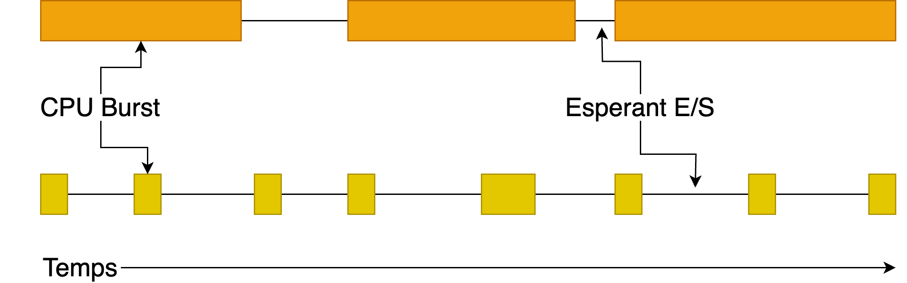
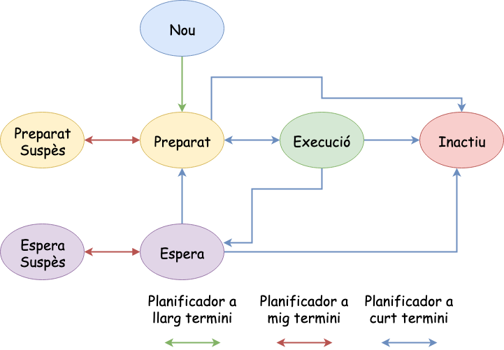
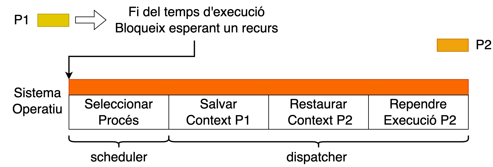

Planificació
=========================================

Necessitat de la planificació (I)
-------------------------------

> - La **multiprogramació** implica que un ordinador té freqüentment diversos *processos* o *fils* (threads) que competeixen per l'ús de la **CPU** simultàniament.
> - Aquesta situació es produeix quan dos o més processos es troben en estat de llista [(*ready state*)]{.alert} alhora.
> - En cas que només hi hagi una **CPU** disponible, cal prendre una decisió sobre quin procés s'executarà a continuació.
> - La part del sistema operatiu que pren aquesta decisió s'anomena planificador (*scheduler*), i l'algorisme que utilitza és l'anomenat **algorisme de planificació**.

Què és la planificació?
------------

La **planificació** en un sistema operatiu consisteix a distribuir eficaçment l'accés als recursos del sistema entre els diferents processos que hi estan en execució. [Aquesta tasca és fonamental per garantir un rendiment òptim del sistema i una resposta eficient a les necessitats dels usuaris]{.alert}.

- Optimitzar el rendiment dels recursos.
- Prioritzar l'accés als recursos disponibles.

Quines són les necessitats dels processos?
---------------------------

\onslide<1->
Els processos presenten necessitats variades a l'hora d'utilitzar els recursos del sistema. En general, la majoria dels processos passen per [cicles de burst]{.alert}, alternant entre **períodes d'activitat intensiva de càlcul** i **períodes d'activitat d'entrada/sortida (E/S)**. Aquesta alternança és crucial per optimitzar l'ús de la CPU i garantir l'eficiència del sistema. Podem tenir processos: *intensius de CPU*, *intensius d'E/S* o *combinats*.

\onslide<2->

{width=70%}

Objectius de la política de planificació
---------------------------------

> - **Equitat**: Garantir que tots els processos tinguin accés als recursos del sistema de manera equitativa.
> - **Polítiques del sistema**: Garantir que les polítiques locals s'apliquin. Per exemple, *si el control de seguretat té prioritat sobre altres processos*, el planificador ha d'assegurar que aquesta política es compleixi en tot moment.
> - **Rendiment**: Optimitzar les mètriques de rendiment del sistema en funció dels objectius del sistema operatiu.

Mètriques de rendiment
---------------------------

> - **Grau d'ús de la CPU**.
> - **Productivitat (Throughput)**. Nº de processos acabats per unitat de temps.
> - **Temps de retorn**. Temps entre el llançament d'un procés (entra a la cua de preparats) fins que finalitza la seva execució.
> - **Temps d'espera**. Temps que el procés està a la cua de preparats.
> - **Temps mitjà espera**. Temps que els processos estan a la cua de preparats.
> - **Temps de resposta**. Temps entre que un procés arranca fins que comença a respondre.
> - **Temps de servei**. Temps esperat per la finalització d'un procés (CPU + E/S).
> - **Temps de retorn normalitzat**. Raó entre el temps de retorn i el temps de servei. Indica el retard d'un procés amb relació a la seva durada.
> - ...

Política de planificació ideal
---------------------------------

\onslide<1->

Existeix alguna política òptima?

[No existeix **cap política òptima** que permeti satisfer tots els criteris anteriors al mateix temps.]{.alert}

\onslide<2->

Un algorisme pot **maximitzar el throughput** però no minimitzar el **temps de resposta**. Imagina un conjunt de tasques *curtes i llargues*, si sempre seleccionem les *curtes* optimitzarem el **throughput** però a cost del **temps de resposta**.

\onslide<3->

\blueArrow La política de planificació òptima depèn:

- Tipus de procés.
- Criteri o criteris a optimitzar.

Exemples
--------

::: columns
::: {.column width="30%"}

### Batch

- Maximitzar el nombre de tasques per unitat de temps (**Throughput**).
- Minimitzar el temps entre que s'envia una tasca i la tasca finalitza (**Temps de retorn**)
- Mantenir la CPU ocupada en tot moment (**Grau d'ús de la CPU**).
  
:::
::: {.column width="30%"}

### Interactiu

- Minimitzar el temps de respsta per millorar l'experiencia d'usuari.
- Garantir la proporcionalitat per ajustar-se a les expectatives de l'usuari en funció de la complexitat percebuda de la tasca.

:::
::: {.column width="30%"}

### Real-time

- Complir els deadlines per evitar fallades en el sistema.
- Mantenir la predictibilitat per evitar la degradació de la qualitat del servei.
:::
:::

Quan s'ha de planificar? (I)
-----------------------

> - **Creació d'un Nou Procés**: Quan es crea un nou procés, s'ha de prendre la decisió de si s'executarà el procés **pare** o el **fill**. Ambdós processos es troben en estat de [ready]{.alert}, i la decisió del planificador pot anar en qualsevol direcció.
> - **Finalització d'un Procés**: Quan un procés finalitza, ja no pot ser en execució, i cal triar un altre procés de l'conjunt de processos en estat de [ready]{.alert}. Si cap procés està a punt, normalment s'executa un procés inactiu (*idle process*) subministrat pel sistema.
> - **Bloqueig d'un Procés**: Quan un procés es bloqueja per *E/S, semàfor o altres motius*, es necessita seleccionar un altre procés per a l'execució. [En alguns casos, la raó de bloqueig pot influir en la selecció del procés següent]{.alert}. \blueArrow Per exemple, si un procés es bloqueja per una operació d'E/S, pot ser més eficient seleccionar un altre procés que no necessiti accedir a un dispositiu d'E/S.

Quan s'ha de planificar? (II)
-----------------------

> - **Interrupció d'E/S**: Quan es produeix una interrupció d'E/S, es pot prendre una decisió de planificació. Si l'interrupció prové d'un dispositiu d'E/S que ha completat la seva tasca, un procés bloquejat que esperava pot estar [ready]{.alert} per a l'execució. El planificador ha de decidir si executar el procés recentment [ready]{.alert}, el procés que estava en **execució** en el moment de la interrupció o un tercer procés.
> - **Interrupcions de l'Hardware (Periòdiques)**: Amb interrupcions periòdiques proporcionades per un rellotge, es poden prendre decisions de planificació. Els algorismes de planificació poden ser cridats a cada interrupció de rellotge o a cada *k-èsima* interrupció de rellotge.

Modes de planificació
-----------------------

Els algorismes de planificació poden ser categoritzats en dues formes segons com gestionen l'ús de la CPU i les decisions de planificació:

1. **No Apropiatius**: Un algorisme no apropiatiu tria un procés per executar i el deixa córrer fins que queda bloquejat (ja sigui per E/S o a l'espera d'un altre procés) o allibera voluntàriament la CPU.

   **OBSERVACIÓ**:Encara que s'estigui executant durant moltes hores, no serà suspès forçosament.Cap decisió de planificació es pren durant les interrupcions de rellotge.

2. **Apropiatiu**: Un algorisme apropiatiu tria un procés i el deixa córrer per un temps màxim fixat.Si el procés encara s'està executant al final de l'interval de temps, és suspès i el planificador tria un altre procés per executar (si n'hi ha disponible).

   **OBSERVACIÓ**: La planificació apropiativa requereix que hi hagi una interrupció de rellotge al final de l'interval de temps per tornar el control de la CPU al planificador.En absència d'un rellotge, l'única opció és la planificació no apropiativa.

Relació entre planificadors
-----------------------------

::: center
{width=70%}
:::

Què necessitem per planificar?
-------------------------------

::: center

:::

Planificació a curt termini
----------------------------

- El *planificador* selecciona un *procés* per ser executat segons un *criteri* determinat.
  
- **Dispacher**: Mòdul que cedeix el control de la CPU al procés seleccionat pel planificador de curt termini.
  
- **Canvi de context**:
  - Salva el context del procés sortint.
  - Restaurar el context del procés entrant.
  - Reprendre l'execució del procés.
    - Canviar a mode usuari.
    - Saltar al punt apropiat del programa.


Algorismes de Planificació a curt termini
===========================================

Simplificacions
---------------

Per intentar comprendre millor els algorismes de planificació, farem les següents simplificacions i ens centrarem ens els conceptes fonamentals de la planificació:

1. **No hi ha suspensió de processos**: Els processos en estat d'execució no podran ser suspesos per cap motiu. Això vol dir que els processos només poden passar de l'estat d'execució a l'estat de preparat perquè han finalitzat la seva execució o perquè han quedat bloquejats per una operació d'E/S.

2. **El temps per intercanviar dos processos és nul**: El temps que triga el sistema a canviar de procés és nul. Això vol dir que el temps que triga el sistema a guardar el context d'un procés i restaurar el context d'un altre procés és nul.

3. **Totes les operacions d'entrada/sortida de diferents processos es poden superposar**: Els processos poden realitzar operacions d'E/S de forma simultània. Això vol dir que si un procés està realitzant una operació d'E/S, un altre procés pot començar una operació d'E/S sense haver d'esperar a que el primer procés finalitzi la seva operació d'E/S.

FCFS o FIFO
---------------

> - El processador s'assignarà seguint l'ordre d'arribada dels processos a la cua de preparats.
> - El procés té la CPU i no l'allibera fins que acaba la seva execució o es bloqueija per una operació d'E/S. (**No Apropiatiu**)
> - La cua de preparats s'implementa amb un cua FIFO (First-In-First-Out).

```pseudocode
Input: n processos amb temps de burst burst_time[1..n]
Output: Ordre d'execució dels processos

Ordena els processos en funció del seu temps d'arribada

Per a cada procés i de 1 a n:
    Executa el procés i durant burst_time[i] unitats de temps
```

Exemple FCFS
-------------

::: columns
::: {.column width="40%"}

\onslide<1->

| Procés | Temps arribada | Ràfegues  |
|--------|----------------|-----------|
| A      | 0              | $7_{CPU}$ |
| B      | 2              | $4_{CPU}$ |
| C      | 3              | $2_{CPU}$ |

Ordenar la llista de processos per temps d'arribada. Això ens dóna l'ordre d'execució dels processos. [A,B,C]{.alert}

\onslide<2->

| P | 0 | 2 | 3 | 7 | 8 |11 |12 |13 |
|---|---|---|---|---|---|---|---|---|
| A | E | E | E | F |   |   |   |   |
| B |   | P | P | E | E | F |   |   |
| C |   |   | P | P | P | E | E | F |

:::
::: {.column width="60%"}

\onslide<3->

- Calcular les mètriques de rendiment.

\onslide<4->

$$ \%_{CPU} = \dfrac{Tcpu_{ocupada}}{Temps}=\dfrac{13}{13}=1=100\%$$

\onslide<5->

$$ Productivitat = \dfrac{\#processos}{Temps}=\dfrac{3}{13}=0.23$$

\onslide<6->

$$ \tilde{T}espera= \dfrac{Te_{A} + Te_{B} + Te_{C} }{\#processos}=\dfrac{0+5+8}{3}=4.3$$

\onslide<7->

$$ \tilde{T}retorn = \dfrac{Tr_{A} + Tr_{B} + Tr_{C}}{\#processos}=\dfrac{7+9+10}{3}=8.6$$

\onslide<8->

$$ \tilde{T}retorn_{N} = \dfrac{7/7 + 9/4 + 10/2}{3}=2.75$$

:::
:::

Característiques FCFS
-----------------------

> - Simple d'implementar.
> - Sensible a l'ordre d'arribada.
> - Temps d'espera molt elevats.
> - Efecte convoy: Afavoreix els processos intensius de CPU perjudicant als menys intensius.

Algorisme SJF ( Shortest Job First)
-------------------------------------

> - La CPU s'assigna al procés amb el temps de burst més curt.
> - En cas d'empat, es pot aplicar un altre algorisme (habitualment FIFO).
> - No apropiatiu.
> - Ordena la cua de preparats en ordre ascendent del temps de burst dels processos.

```pseudocode
Input: n processos amb temps de burst burst_time[1..n]
Output: Ordre d'execució dels processos

Ordena els processos en funció del seu temps de burst (shortest first)

Per a cada procés i de 1 a n:
    Executa el procés i durant burst_time[i] unitats de temps
```

Exemple SJF
-------------

::: columns
::: {.column width="40%"}

\onslide<1->

| Procés | Temps arribada | Ràfegues  |
|--------|----------------|-----------|
| A      | 0              | $7_{CPU}$ |
| B      | 2              | $4_{CPU}$ |
| C      | 3              | $2_{CPU}$ |

\onslide<3->

| P | 0 | 2 | 3 | 7 | 8 | 9 |12 |13 |
|---|---|---|---|---|---|---|---|---|
| A | E | E | E | F |   |   |   |   |
| C |   |   | P | E | E | F |   |   |
| B |   | P  | P | P | P | E | E | F |

::: 
::: {.column width="60%"}

\onslide<3->

- Calcular les mètriques de rendiment.

\onslide<4->

$$ \%_{CPU} = \dfrac{Tcpu_{ocupada}}{Temps}=\dfrac{13}{13}=1=100\%$$

\onslide<5->

$$ Productivitat = \dfrac{\#processos}{Temps}=\dfrac{3}{13}$$

\onslide<6->

$$  \tilde{T}espera = \dfrac{Te_{A} + Te_{B} + Te_{C} }{\#processos}=\dfrac{0+7+4}{3}=3.6$$

\onslide<7->

$$  \tilde{T}retorn = \dfrac{Tr_{A} + Tr_{B} + Tr_{C} }{\#processos}=\dfrac{7+11+6}{3}=8$$

\onslide<8->

$$  \tilde{T}TretornN = \dfrac{7/7 + 11/4 + 6/2}{3}=2.25$$

:::
:::

Característiques
-------------------------

> - **Reducció del temps d'espera mitjà**: L'algorisme *SJF* minimitza el temps que els processos han d'esperar a la cua de preparats, ja que els processos amb temps de burst més curts s'executen primer, optimitzant així l'eficiència del sistema.

> - **Esmorteïment de l'efecte convoy**: L'efecte convoy es produeix quan un procés amb temps de burst llarg bloqueja altres processos que podrien ser més curts. L'algorisme *SJF* evita aquest efecte, ja que dona prioritat als processos amb temps de burst més curts.

> - **Dificultat de predir la següent ràfega de CPU**: Una de les limitacions de l'algorisme *SJF* és la dificultat de predir amb precisió el temps que durarà la pròxima ràfega d'un procés. Aquesta incertesa es pot abordar mitjançant una estimació del temps de burst, com ara l'ús d'una mitjana ponderada: $EstRaf_{n+1}=\alpha \cdot EstRaf_n + (1-\alpha) \cdot Raf_n$ on $\alpha$ és un factor de ponderació que pot ser ajustat per reflectir millor el comportament real del sistema.
> - **Risc d'inanició dels processos intensius de CPU**: Un dels riscos de l'algorisme SJF és l'inanició dels processos amb temps de burst llargs. Si arriben constantment nous processos amb temps de burst més curt, els processos intensius de CPU poden quedar relegats i mai arribar a ser executats.

Short Remaining Time (SRT)
---------------------------

L'algorisme *SRT* (Shortest Remaining Time) és una variant de l'algorisme *SJF* (Shortest Job First) que es caracteritza per canviar el procés en execució si arriba un nou procés amb un temps de burst més curt que el que està executant actualment. \blueArrow SRT = SJF apropiatiu.

| Procés | Temps arribada | Ràfegues  |
|--------|----------------|-----------|
| A      | 0              | $7_{CPU}$ |
| B      | 2              | $4_{CPU}$ |
| C      | 3              | $2_{CPU}$ |

**ACTIVITAT**: Realitzeu la planificació i el calcul de mètriques de l'exemple anterior amb l'algorisme SRT.

Solució a l'activitat SRT
---------------------------

| P | 0 | 1 | 2 | 3 | 4 | 5 | 6 | 7 | 8 | 9 | 10 | 11 | 12 | 13 |
|---|---|---|---|---|---|---|---|---|---|---|----|----|----|----|
| A | E | E | P | P | P | P | P | P | E | E | E  | E  | E  | F  |
| B |   |   | E | P | P | E | E | E | F |  |   |   |   |   | |
| C |   |   |   | E | E | F |   |   |   |   |    |    |    |    |

::: columns
::: {.column width="45%"}

$$ \tilde{T}espera = \dfrac{T_{A} + T_{B} + T_{C}}{\#processos}=\dfrac{6+2+0}{3}=2.6$$

$$ \tilde{T}retorn = \dfrac{T_{A} + T_{B} + T_{C}}{\#processos}=\dfrac{13+6+2}{3}=7$$

:::
::: {.column width="45%"}

$$ \tilde{T}resposta = \dfrac{T_{A} + T_{B} + T_{C}}{\#processos}=\dfrac{0+0+0}{3}=0$$

$$ \tilde{T}retornN =\dfrac{13/7 + 6/4 + 2/2}{3}=1.45$$
:::
:::

Algorisme per prioritats
---------------------------

> - L'algorisme per prioritats assigna un valor de prioritat a cada procés. El planificador selecciona el procés de la cua de preparats que té la prioritat més alta per a l'execució. En cas d'empat, es pot aplicar un altre algorisme (habitualment FIFO).
> - Cada procés té assignada una prioritat, un valor enter que determina la seva importància relativa. El planificador selecciona el procés amb la prioritat més alta en la cua de preparats per a l'execució.
> - La política pot ser **apropiativa** o **no**.
> - Les prioritats es poden definir de forma interna (pel sistema operatiu) o de forma externa (pels usuaris).
> - Prioritats estàtiques o dinàmiques.

Exemple: Prioritats Apropiatiu
------------------------------

::: columns
::: {.column width="40%"}

\onslide<1->

| Procés |T| Ràfegues  | Prioritat |
|--------|-|-----------|-----------|
| A      |0| $7_{CPU}$ | 5         |
| B      |2| $4_{CPU}$ | 1         |
| C      |3| $2_{CPU}$ | 6         |

Ordenar la llista de processos per prioritat. Suposem prioritat ascendent. [A,B,A,C]{.alert}

\onslide<2->

| P | 0 | 2 | 3 | 6 | 11|12 |13 |
|---|---|---|---|---|---|---|---|
| A | E | P | P | E | F |   |   |
| B |   | E | E | F |   |   |   |
| C |   |   | P | P | E | E | F |

::: 
::: {.column width="60%"}

\onslide<3->

- Calcular les mètriques de rendiment.

\onslide<4->

$$ \%_{CPU} = \dfrac{Tcpu_{ocupada}}{Temps}=\dfrac{13}{13}=1=100\%$$

\onslide<5->

$$ Productivitat = \dfrac{\#processos}{Temps}=\dfrac{3}{13}$$

\onslide<6->

$$ \tilde{T}espera = \dfrac{Te_{A} + Te_{B} + Te_{C}}{\#processos}=\dfrac{4+0+8}{3}=4$$

\onslide<7->

$$ \tilde{T}retorn = \dfrac{Tr_{A} + Tr_{B} + Tr_{C}}{\#processos}=\dfrac{11+4+10}{3}=8.33$$

\onslide<8->

$$ \tilde{T}resposta = \dfrac{Tr_{A} + Tr_{B} + Tr_{C}}{\#processos}=\dfrac{0+0+8}{3}=2.66$$

:::
:::


Envelliment
----------------

Amb els **algorismes de prioritat**, els processos amb prioritat baixa poden quedar inactius indefinidament (inanició) si sempre hi ha processos amb prioritat més alta a la cua de preparats.

[**L'envelliment**]{.alert} és una estratègia utilitzada per abordar el problema d'inanició que pot sorgir en els algorismes de planificació basats en prioritats. \blueArrow Augmenta periòdicament la prioritat dels processos preparats que no aconsegueixen executar-se.

```pseudocode
function Aging(processes):
    for each process in processes:
        if process.waitingTime >= agingThreshold:
            process.increasePriority() // Augmenta la prioritat del procés
```

Algorisme Round-Robin (Turn rotatiu)
-------------------------------------

L'algorisme **Round-Robin** és un mètode de planificació **apropiatiu** en el qual cada procés rep una quantitat fixa de temps en CPU coneguda com a [**quantum**]{.alert}. Aquesta assignació es fa de manera rotativa seguint l'ordre d'arribada dels processos (*FIFO*).

> - Si un procés no finalitza la seva execució durant el seu quantum, el procés és suspès i es col·loca al final de la cua de preparats.
> - Si un procés es bloqueja durant la seva execució, el procés és suspès i es col·loca al final de la cua de preparats.
> - Es requereix un temporitzador que, cada *quantum unitats de temps*, invoqui al planificador per canviar de procés.
> - Permet acotar els temps de resposta dels processos.
> - Garanteix que cada procés obtindrà la CPU en un temps limitat (quantum), evitant així que un procés monopolitzi excessivament la CPU.


Exemple Round-Robin amb quantum 1
------------------------------
::: columns
::: {.column width="30%"}
Assumirem que en cas d'empat on 2 processos arribin a la cua de preparats al mateix temps, s'executarà el procés amb prioritat més elevada en aquest cas (*C,B,A*).

\onslide<3->

$$ \tilde{T}e = \dfrac{6+5+3}{3}=4.66$$

\onslide<4->

$$ \tilde{T}retorn =\dfrac{13+9+5}{3}=9$$

:::
::: {.column width="70%"}

\onslide<2->

| P | 0 | 1 | 2 | 3 | 4 | 5 | 6 | 7 | 8 | 9 | 10 | 11 | 12 | 13 |
|---|---|---|---|---|---|---|---|---|---|---|----|----|----|----|
| A | E | E | P | E | P | P | E | P | P | E |  P | E  | E  | F  |
| B |   |   | E | P | P | E | P | P | E | P | E  | F  |    |    |
| C |   |   |   | P | E | P | P | E | F |   |    |    |    |    |

\onslide<5->

$$ \tilde{T}resposta =\dfrac{0+0+1}{3}=0.33$$

\onslide<6->

$$ \tilde{T}retornN = \dfrac{13/7 + 9/4 + 5/2}{3}=2.2$$

:::
:::


Comparativa d'algorisme de planificació
-----------------------------------------

| Alg.                  | $\tilde{T}espera$   | $\tilde{T}retorn$  | $\tilde{T}resposta$ | $\% (CC=0.25)$|
|-----------------------|----------------|---------------|----------------|------------------------|
| **FCFS**              | 4.3            | 8.6           | 4.3            | 96%                    |
| **SJF**               | 3.6            | 8.0           | 3.6            | 96%                    |
| **Prioritats**        | 4.0            | 8.33          | 2.66           | 94%                    |
| **RR (Q=1)**         | 4.66           | 9              | 0.33           | 81%                    |

CC = Canvi de Context. Assumim un escenari més realista on cada canvi de context té un cost.

### Nota

Cap algorisme treu els millors resultats en totes les mètriques.


Càlculs amb canvis de context
--------------------------------

Per calcular les mètriques amb canvis de context, s'ha de tenir en compte que cada canvi de context té un cost. A la taula comparativa anterior, s'ha assumit que el cost de cada canvi de context és de 0.25 unitats de temps.

$$ \%_{CPU} = \dfrac{Tcpu_{ocupada}}{Temps}=\dfrac{13}{13}=1=100\%$$

::: columns
::: {.column width="45%"}

- SJF i FCFS: Han realitzat 2 canvis de context.
   - $Tcpu_{ocupada}=13-2\cdot 0.25=12.5$
   - $\%_{CPU}=\dfrac{12.5}{13}=0.96=96\%$

:::
::: {.column width="45%"}

- Prioritats: Ha realitzat 3 canvis de context.
   - $Tcpu_{ocupada}=13-3\cdot 0.25=12.25$
   - $\%_{CPU}=\dfrac{12.25}{13}=0.94=94\%$

:::
:::

::: center
- Round Robin: Ha realitzat 10 canvis de context.
  - $Tcpu_{ocupada}=13-10\cdot 0.25=10.5$
  - $\%_{CPU}=\dfrac{10.5}{13}=0.81=81\%$
:::


Activitat de reforç: Planificació amb E/S
---------------------------

Realitza la planificació dels següents processos utilitzant els algorismes de planificació **Round Robin amb un quantum de 3 unitats de temps** i **SJF (Shortest Job First) no apropiatiu**. En cas d'empat on 2 processos arribin a la cua de preparats al mateix temps, s'executarà el procés amb prioritat més elevada en aquest cas (*B,A,C*).
  
| Procés | Temps arribada | Ràfegues  |
|--------|----------------|-----------|
| A      | 7              | $5_{CPU},2_{E/S},4_{CPU}$ |
| B      | 3              | $4_{CPU},1_{E/S},1_{CPU},1_{E/S},1_{CPU}$  |
| C      | 1              | $2_{CPU},1_{E/S},3_{CPU},2_{E/S},1_{CPU}$ |

Es demana:
- Mostrar la planificació dels processos en un diagrama de Gantt.
- Calcular el temps d'espera, resposta i retorn mitjà de cada procés.
- Comparar els resultats obtinguts amb els algorismes de planificació.

Plantilla de la solució
------------------------

| P | 0 | 1 | 2 | 3 | 4 | 5 | 6 | 7 | 8 | 9 | 10 | 11 | 12 | 13 | 14 | 15 | 16 | 17 | 18 | 19 | 20 | 21 | 22 | 23 |
|---|---|---|---|---|---|---|---|---|---|---|----|----|----|----|----|----|----|----|----|----|----|----|----|----|
| A |   |   |   |   |   |   |   |   |   |   |    |    |    |    |    |    |    |    |    |    |    |    |    |    |
| B |   |   |   |   |   |   |   |   |   |   |    |    |    |    |    |    |    |    |    |    |    |    |    |    |
| C |   |   |   |   |   |   |   |   |   |   |    |    |    |    |    |    |    |    |    |    |    |    |    |    |


| P | 0 | 1 | 2 | 3 | 4 | 5 | 6 | 7 | 8 | 9 | 10 | 11 | 12 | 13 | 14 | 15 | 16 | 17 | 18 | 19 | 20 | 21 | 22 |
|---|---|---|---|---|---|---|---|---|---|---|----|----|----|----|----|----|----|----|----|----|----|----|----|
| A |   |   |   |   |   |   |   |   |   |   |    |    |    |    |    |    |    |    |    |    |    |    |    |
| B |   |   |   |   |   |   |   |   |   |   |    |    |    |    |    |    |    |    |    |    |    |    |    |
| C |   |   |   |   |   |   |   |   |   |   |    |    |    |    |    |    |    |    |    |    |    |    |    |

Omplir amb **E** representa que el procés està en estat d'execució (CPU), **W** que el procés esta fent operacions E/S. **P** indica que el procés està esperant a la cua, i **F** indica que el procés ha finalitzat la seva execució.


Solució per a Round Robin amb quantum 3
------------------------

| P | 0 | 1 | 2 | 3 | 4 | 5 | 6 | 7 | 8 | 9 | 10 | 11 | 12 | 13 | 14 | 15 | 16 | 17 | 18 | 19 | 20 | 21 | 22 | 23 |
|---|---|---|---|---|---|---|---|---|---|---|----|----|----|----|----|----|----|----|----|----|----|----|----|----|
| A |   |   |   |   |   |   |   | P | P | P | E  | E  | E  | P  | P  | E  | E  | W  | W  |  E | E  | E   | E | F  |  
| B |   |   |   | E | E | E | P | P | P | E | W  | P  | P  | E  | W  | P  | P  | E  | F  |    |    |     |   |    | 
| C |   | E | E | W | P | P | E | E | E | W | W  | P  | P  | P  | E  | F  |   |     |    |    |    |     |   |    | 

$$\tilde{T}espera=\dfrac{5+7+5}{3}=5.66 \;\; cicles$$
$$\tilde{T}resposta=\dfrac{3+0+0}{3}=1 \;\; cicles$$
$$\tilde{T}retorn=\dfrac{16+15+14}{3}=15 \;\; cicles$$

Solucio (SJF) no apropiatiu
------------------------

| P | 0 | 1 | 2 | 3 | 4 | 5 | 6 | 7 | 8 | 9 | 10 | 11 | 12 | 13 | 14 | 15 | 16 | 17 | 18 | 19 | 20 | 21 | 22 |
|---|---|---|---|---|---|---|---|---|---|---|----|----|----|----|----|----|----|----|----|----|----|----|----|
| A |   |   |   |   |   |   |   | P | P | P | P  | E  | E  | E  | E  | E  | W  | W  |  E | E  | E  | E  | F  |
| B |   |   |   | E | E | E | E | W | P | P | E  | W  | P  | P  | P  | P  | E  | F  |    |    |    |    |    |
| C |   | E | E | W | P | P | P | E | E | E | W  | W  | P  | P  | P  | P  | P  | E  |  F |    |    |    |    |


$$\tilde{T}espera=\dfrac{4+6+8}{3}=6 \;\; cicles$$
$$\tilde{T}resposta=\dfrac{4+0+0}{3}=1.33 \;\; cicles$$
$$\tilde{T}retorn=\dfrac{15+14+17}{3}=15.33 \;\; cicles$$

## Això és tot per avui

::: center
[**PREGUNTES?**]{.alert}

:::

::: columns
::: {.column width="50%"}

### Materials del curs

* **Organització**   --- [OS-GEI-IGUALADA-2425](https://github.com/OS-GEI-IGUALADA-2425)
* **Materials**    --- [Materials del curs](https://github.com/OS-GEI-IGUALADA-2425/materials)
* **Laboratoris**  --- [Laboratoris](https://github.com/OS-GEI-IGUALADA-2425/laboratoris)
* **Recursos**    --- [Campus Virtual](https://cv.udl.cat/)

[**TAKE HOME MESSAGE**]{.alert}: La planificació de processos és un dels aspectes més importants dels sistemes operatius. Els algorismes de planificació són fonamentals per garantir l'eficiència i el rendiment del sistema.

:::
::: {.column width="45%"}

:::center
{width=40mm}
:::

:::
:::